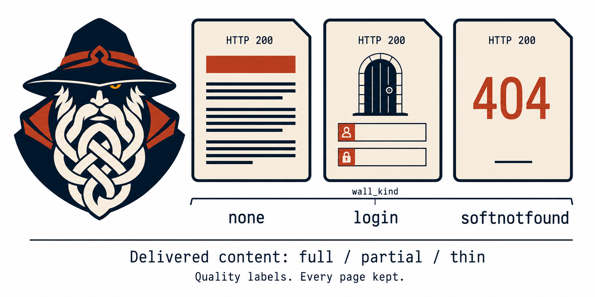
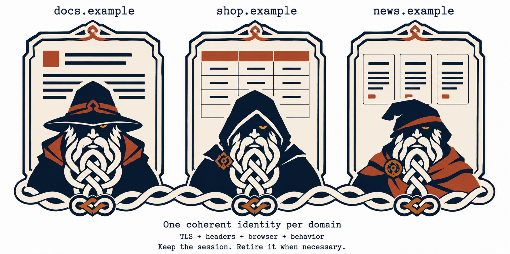

<p align="center">
  <picture>
    <source media="(prefers-color-scheme: dark)" srcset="assets/brand/svipall-lockup-dark.svg">
    
  </picture>
</p>

<h3 align="center">A different face at every gate.</h3>

<p align="center">
  <b>Web reading for your AI agent — running on your own machine.</b><br>
  An MCP server and CLI, in Rust, that extracts web pages into Markdown,<br>
  crawls sites within configured limits, searches without an API key, and attempts supported challenges —<br>
  then tells you plainly about the ones it cannot.
</p>

<p align="center">
  <a href="https://www.rust-lang.org"></a>
  <a href="#license"></a>
  <a href="#mcp-tools"></a>
  <a href="#development"></a>
  <a href="#proof-every-number-with-the-command-that-reproduces-it"></a>
  <a href="#privacy-and-safety"></a>
</p>

<p align="center">
  <a href="#install"><b>Install</b></a> &middot;
  <a href="#what-you-can-actually-do-with-it"><b>Use cases</b></a> &middot;
  <a href="#proof-every-number-with-the-command-that-reproduces-it"><b>Proof</b></a> &middot;
  <a href="#mcp-tools"><b>Tools</b></a> &middot;
  <a href="#captcha-solving-fully-local"><b>Captcha</b></a> &middot;
  <a href="#the-rest-api"><b>REST API</b></a> &middot;
  <a href="#how-svipall-compares"><b>Compare</b></a> &middot;
  <a href="#faq"><b>FAQ</b></a>
</p>

---

**Local processing. No third-party API keys. No paid captcha services. No telemetry.**
Web requests reach the sites you visit, and results reach the agent or client you connect.

Svipall fetches and renders pages locally, extracts their content, and reports detected challenges
and extraction-quality labels. Some sites still block it, and an apparently successful response
can contain incomplete records or a page shell. The published comparisons therefore audit useful
content separately from HTTP status and the tool's own verdict.

## Why Svipall

| What goes wrong | Svipall |
|---|---|
| Your agent reads a "checking your browser" screen and summarises it as the article. It was a `200`, so nothing flagged it | Twelve wall kinds, each naming the move it implies. **Detected blocks carry an explicit verdict**; classification is heuristic [→](#judging-what-came-back) |
| You crawl 5,000 pages and can't tell which are worth keeping | Assessed pages carry quality and duplicate observations; **quality labels do not discard pages** [→](#judging-what-came-back) |
| One page = 300,000 tokens of raw HTML. The fixes are four manual jobs you now own | Clean Markdown by default; opt into tables as rows, `out_file` to disk, or capture of the site's own JSON API [→](#reading) |
| You want to attempt a supported captcha without a paid solver | Nine local strategies, optional vision models depending on the build, and a human dashboard for unresolved challenges [→](#captcha-solving-fully-local) |

It records successful visits, failures, incomplete extraction and rejected changes. Historical
benchmark logs and the current comparison use different scoring rules and configurations;
the [results section](#proof-every-number-with-the-command-that-reproduces-it) distinguishes them.

Rust · MCP + CLI + REST · no Node, no Python, no API key · local storage and processing
→ **[Install it ↓](#install)**

The [comparison table](#how-svipall-compares) describes other projects' documented scope.

<details>
<summary><b>Table of contents</b></summary>

- [**Why Svipall**](#why-svipall)
- [Install](#install) — [ask your agent](#ask-the-agent-you-already-have) · [**Claude Code plugin**](#claude-code-install-the-plugin) · [install it yourself](#install-it-yourself) · [from a shell](#or-drive-it-from-a-shell) · [what comes back](#what-comes-back) · [in a container](#or-run-it-in-a-container) · [full install guide](docs/install.md) · [never done this before](GET-STARTED.md)
- [What you can actually do with it](#what-you-can-actually-do-with-it) · [who it is for](#who-it-is-for)
- [**Proof**: every number, with the command that reproduces it](#proof-every-number-with-the-command-that-reproduces-it)
  - [Extraction quality vs. readability, trafilatura and resiliparse](#extraction-quality--measured-against-public-corpora-including-where-it-loses)
  - [`public31` — the independent list](#anti-bot-public31-the-independent-list-scored-by-its-own-rule) · [`hard12`](#anti-bot-hard12-our-own-list-chosen-because-it-has-walls) · [`vendors8`](#anti-bot-vendors8-four-vendors-named-two-targets-each)
  - [**Failures investigated in earlier runs**](#what-svipall-does-not-get-past-and-why)
  - [Automation tells](#automation-tells--160-of-160-offline-and-it-fails-the-build) · [identity coherence](#identity-coherence--asserted-offline-in-ci) · [CPU budgets](#cpu-budgets--measured-not-recalled)
- [Features](#features) — [reading](#reading) · [judging what came back](#judging-what-came-back) · [getting in](#getting-in) · [acting](#acting) · [crawling](#crawling) · [remembering](#remembering-and-staying-safe)
- [How it works, in plain words](#how-it-works-in-plain-words)
- [MCP tools](#mcp-tools) · [the CLI](#the-cli)
- [Captcha solving, fully local](#captcha-solving-fully-local) · [the human dashboard](#the-human-dashboard) · [training your own models](#training-your-own-models)
- [The REST API](#the-rest-api)
- [Privacy and safety](#privacy-and-safety) · [limits, stated on purpose](#limits-stated-on-purpose)
- [Configuration](#configuration)
- [How Svipall compares](#how-svipall-compares) — Firecrawl, Crawl4AI, Scrapling, Playwright MCP
- [Architecture](#architecture) · [documentation](#documentation) · [development](#development) — [build from source](#build-from-source)
- [FAQ](#faq) · [about the name](#about-the-name) · [licence](#license) · [trademark](#trademark) · [disclaimer](#disclaimer)

</details>

---

## Install

**Source and release scope (checked 2026-09-07):** this README describes the current development
tree. The latest published [GitHub release](https://github.com/ilien-dev/svipall/releases) and
[npm package](https://www.npmjs.com/package/svipall) are `1.0.0-rc`, predating the current automatic
routing work and its measurements. Installing that release does not install the changes measured
in the 2026-09-07 comparison. Use the matching source snapshot for those results and run `svipall doctor` to
inspect an installed build's capabilities.

The [README factual audit](bench/experiments/native-auto-candidate2-20260907/readme-factual-audit.md)
records the source checks, documentation corrections and limits of this review.

Choose agent-assisted setup, the Claude Code plugin, or a manual installation.

### Ask the agent you already have

Paste this into Claude Code, Cursor, Codex, opencode, or anything else that can run a command:

```
Install and configure Svipall by following the instructions here:
https://raw.githubusercontent.com/ilien-dev/svipall/main/docs/install.md
```

That page guides an agent through platform detection, installation, verification and MCP
registration. Completion depends on the agent, client configuration and available permissions.

### Claude Code: install the plugin

```
/plugin marketplace add ilien-dev/svipall
/plugin install svipall@svipall
/svipall:setup
```

`/svipall:setup` installs the binary if it is missing, checks the server answers, and offers to make
Svipall the way Claude reaches the web in every project. It asks before each of those.
`/svipall:doctor` reports the installation's capabilities. `/svipall:uninstall` offers removal
of setup's registration, memory and strict-mode changes; binary and data removal are separate choices.

### Install it yourself

One line, no toolchain, nothing to compile:

```bash
curl -fsSL https://raw.githubusercontent.com/ilien-dev/svipall/main/install.sh | sh   # macOS, Linux
irm https://raw.githubusercontent.com/ilien-dev/svipall/main/install.ps1 | iex        # Windows
```

Or a package manager, or the container image:

```bash
brew install ilien-dev/svipall/svipall               # macOS, Linux
scoop bucket add svipall https://github.com/ilien-dev/scoop-svipall && scoop install svipall
docker pull ghcr.io/ilien-dev/svipall:1.0.0-rc       # use a published version tag; see container notes
npx --yes svipall doctor                             # if node is already there
```

The checked release includes Linux x86-64 `.deb` and `.rpm` packages. The shell, PowerShell and
npm installers download release archives and attempt checksum verification. A checksum mismatch
stops installation, but a missing checksum file, entry or hashing utility can produce a warning
and allow installation to continue. Inspect the installer output; a successful exit alone is not
proof that the archive was verified. Container images use their own registry/build distribution.

**Among the published packages, the full container carries captcha models for Linux and Intel Mac**, and
on Linux arm64 it is also the only one that brings a browser. The binaries there can attempt
non-model strategies and use human assistance; the [platform table](docs/install.md#which-platforms-have-builds) has the
detail and the [FAQ](#faq) says what the difference costs.

<details>
<summary>winget and the AUR: not yet</summary>

Publication through winget or AUR is not confirmed by this audit. The manifests are rendered from each release's
own `sha256sums.txt` by `scripts/render-packaging.sh`, so what is left is publishing them rather
than writing them; [`packaging/README.md`](packaging/README.md) says what each one needs. Until
then use one of the confirmed channels above rather than assuming those commands are available.
</details>

Never installed anything from a terminal before? [**GET-STARTED.md**](GET-STARTED.md) is the same
thing with nothing assumed. Everything else, including
[building from source](docs/install.md#3-building-from-source-instead), is in
[docs/install.md](docs/install.md).

Then ask it what it can do on this machine, and what to run for anything it cannot:

```bash
svipall doctor
```

Wiring it into a client, when nothing did it for you:

```bash
claude mcp add svipall -- svipall-mcp
```

With node already there, nothing needs installing first at all — the package downloads the same
release build on its first run:

```bash
claude mcp add svipall -- npx --yes --package svipall svipall-mcp
```

<details>
<summary>Claude Desktop, Cursor, or any other MCP client</summary>

```json
{
  "mcpServers": {
    "svipall": {
      "command": "svipall-mcp"
    }
  }
}
```

Use an absolute path if the client does not inherit your shell's PATH — GUI apps on macOS usually
do not.
</details>

### Then ask for something

No key to paste, no account to create, no service to sign up for.

> *"Read this page and summarise the pricing."*
> *"Crawl these docs and write me an `llms.txt`."*
> *"Watch this listing and tell me when the price moves."*
> *"Get me every row of that table as CSV."*

The assistant can choose among the exposed tools. A human dashboard for supported challenges needing a pair of
eyes lives at `http://localhost:8787/human`.

### Or drive it from a shell

```bash
svipall fetch https://example.com/article
svipall fetch https://shop.example/item --query "shipping costs"
svipall fetch https://docs.example/api --schema auto        # rows from a listing you've never seen
svipall crawl https://docs.example/ --pages 50 --out pages.csv
svipall search "rust async runtime" --engine all
svipall snapshot https://news.ycombinator.com                # the page as roles and refs, not markup
svipall serve --port 8788                                    # the same server as a local REST API
```

Completed data commands print **one JSON object** to stdout; diagnostics go to stderr, so their
output can be piped to `jq`. `serve` is a long-running server, and help is written to stderr.

### What comes back

A historical run of `svipall fetch https://example.com`, with the `content` string cut short.
Current automatic fetches also report identity and fallback fields described below:

```json
{
  "attempts": ["http: 200 (170ms) OK"],
  "chars": 167,
  "content": "# Example Domain\n\nThis domain is for use in documentation examples…",
  "exit": null,
  "final_url": "https://example.com/",
  "optimization": "ordinary",
  "quality": "thin",
  "quality_reasons": ["thin_text"],
  "status": 200,
  "tier_used": "http",
  "title": "Example Domain",
  "tokens_estimated": 42,
  "url": "https://example.com"
}
```

`tier_used` says how hard it had to try. `quality` says what actually arrived — and when a page does
*not* arrive, the same object carries `blocked_reason`, `wall_kind`, `wall_vendor`, `wall_evidence`
and a `note` telling your agent what to do next. Straight from a committed benchmark record:

```json
{ "wall_kind": "vendor", "wall_vendor": "kpsdk.io", "wall_evidence": "header x-kpsdk-ct" }
```

**A detected block carries a verdict alongside the returned content.** A clear verdict still
needs a content check; the classifier is not proof that the requested records arrived intact.

### Or run it in a container

```bash
claude mcp add svipall -- docker run -i --rm -v svipall-home:/data ghcr.io/ilien-dev/svipall:1.0.0-rc
```

The Dockerfile defines full and slim builds. The full version tag above carries a browser **and** the captcha
models, both supplied at image build time. Browser tiers still need a suitable display/runtime
environment for headful operation; a bundled browser is not proof that every tier works in a
headless container. `slim`
carries neither: it is the http tier, and a page behind a challenge stays blocked. Both are built
for `linux/amd64` and `linux/arm64`.

**The full image bundles components omitted from the published Linux binaries.** Those binaries carry no
captcha models, and on arm64 they cannot install a browser either — the reasons are
in the [FAQ](#faq). The image has both, and on arm64 its browser is the
distribution's own Chromium rather than Chrome for Testing, which `svipall doctor` reports as
`chromium` instead of `managed`. That identification is not a measured fingerprint-quality ranking.

Everything it learns lives in the `svipall-home` volume, and `-i` is what keeps stdin open for MCP.
Publish `-p 8787:8787` to reach the dashboard: loopback inside a container means the container, so
the entrypoint writes a `/data/config.toml` binding `0.0.0.0` the first time it starts, and never
touches one you wrote yourself.

A pre-release publishes its own version tag and leaves the moving ones alone, so while the newest
release is a candidate, `:latest` and `:slim` may not exist yet or may point at the release before
it — pull `ghcr.io/ilien-dev/svipall:<version>` to get the newest.

Tagged releases attach builds for **Windows x86-64, macOS Intel, macOS Apple silicon, Linux x86-64
and Linux arm64** with a `sha256sums.txt` and a GitHub build attestation, and push both images to
`ghcr.io`.

---

## What you can actually do with it

| You want to… | It looks like this |
|---|---|
| **Read one page cleanly** | `web_fetch` → Markdown with heuristic boilerplate removal and sanitization; `query=` ranks text by lexical relevance |
| **Turn a listing into rows** | `schema: "auto"` reads the page's own repeated structure, names the columns and hands back typed rows — no model, no API, one parse |
| **Pull a data table** | `tables=true` → typed rows; `out_file: rows.csv` writes them to disk so thousands of rows never touch your context |
| **Skip the scraping entirely** | `web_capture` returns the JSON the page fetched while loading — usually the site's real API, with `?page=2` waiting for you |
| **Turn a docs site into a corpus** | `web_crawl` with `llms.txt` output, near-duplicate labels, resumable frontier and lexical saturation stopping, subject to page/token/traffic limits |
| **Search without a key** | `web_search` scrapes DuckDuckGo, Bing and Brave; `engine="all"` merges them by agreement |
| **Let the agent click things** | `web_snapshot` (roles + refs, a fraction of the tokens) then `web_act` — click, type, scroll, wait, all through human-like input |
| **Attempt a browser challenge** | Automatic routing can escalate to a patient browser tier; unresolved challenges and detected blocks are reported, but the remote cause is not always identifiable |
| **Attempt a captcha locally** | Fifteen widget families and eleven answer modalities, model support where available and a phone-friendly human dashboard. No paid solver; local budgets and remote restrictions still apply |
| **Log in once and stay in** | `web_login` opens a real window; you sign in; the cookies are kept in a profile you can export |
| **Watch a page** | `web_watch` checks the whole page or one CSS region while the server runs; saved selector fingerprints can help recover some redesigns |
| **Read PDFs and Office files** | docx, xlsx, pptx, odt, epub, rtf, csv and pdf come back as Markdown, from the web or from `file://` |
| **Drive it from any language** | `svipall serve` → 19 local REST routes, one per tool, behind a bearer key it generates for you |

### Who it is for

| You are… | Svipall gives you… |
|---|---|
| **A Claude Code / Claude Desktop / Cursor user** | One line of setup and tools your assistant picks by itself. Research, documentation, price comparison, monitoring |
| **A developer building AI agents** | A local web layer with structured output, token budgets, file export and resumable crawls; live web outcomes remain variable |
| **A RAG / dataset builder** | Bounded site crawls to Markdown, near-duplicate labels, `llms.txt`, and quality observations for assessed pages |
| **A data or research person** | Pages that sit behind "checking your browser" walls — and an honest answer when your address cannot open one |
| **A privacy-conscious operator** | No scraping API, no captcha farm, no geolocation lookup, no update check, no telemetry. Additional downloads are the managed browser when needed (automatic provisioning can be disabled) and the blocklists you enabled |
| **A security or QA engineer** testing your own site | A reproducible benchmark whose raw run logs are committed in this repository, and a request log that names which tier answered and which wall appeared |

Svipall is **not** a hosted scraping API and does not try to be one. If you want a URL you can `curl`
from a serverless function, use a cloud service. If you want the web inside your own agent, on your
own hardware, Svipall provides that processing locally; browser traffic and optional downloads
are described under [Privacy and safety](#privacy-and-safety).

---

## Proof: every number, with the command that reproduces it

This project publishes its own benchmarks and reports the number it gets, not the number it would
like. Raw run logs and JSON are committed in [`bench/baseline/`](bench/baseline/) — including the
rounds of work that improved nothing, and the rounds where a number went *down*.

| Gate | Result | Needs network? | Command |
|---|---|---|---|
| Test suite | **1,216 passing**, 0 failing, 22 ignored (2026-09-07) | no | `cargo test --workspace` |
| Automation tells | **160 / 160** probes clean — 32 probes × 5 browser passes | no, but needs a browser | `bench tells --assert` |
| Identity coherence | **8 / 8** — 7 identities plus a 1,500-machine sweep | no | `bench fingerprint --engine chrome` |
| Network fingerprint | **8 / 8** wire checks against `tls.peet.ws` | yes | `bench fingerprint` |
| CPU budgets | **11 timed budgets + 4 structural checks**, all inside budget | no | `bench micro --assert` |
| Extraction quality | median ROUGE-LSum F1 **0.920** over 3,975 pages | no, once the corpus is fetched | `bench extract --corpus DIR` |
| Historical evasion, independent list | **26 / 31**, range 25..26, **zero hard blocks** | yes | `bench evasion --set public31 --runs 3` |
| Historical evasion, our own hard list | **7 / 12**, range 7..8 | yes | `bench evasion --set hard12 --runs 3` |
| Historical evasion, four named vendors | **3 / 8**, range 2..3 | yes | `bench evasion --set vendors8 --runs 3` |

**The rule for those three historical evasion rows:** median of three runs with its range, targets in a
fresh random order each run, cooldowns cleared first, from **a single residential address with no
proxy**. A change counts as an improvement only when the median leaves the previous range. The
reputation spend is deliberately *not* cleared, and `bench evasion` refuses to start a list whose
address has already spent past the line.

> These are historical results: `public31` was re-taken on 2026-09-05; **`hard12` and `vendors8`
> carry their 2026-09-04 and 2026-09-05 figures. All three predate the current automatic policy.**
> The latter two were not re-taken in that round
> because running `public31` spends the same addresses they score, and taking all three back to back
> is the exact thing that produced a round this project already published as a warning.

The `browser_identity=auto` policy has [controlled local verification](bench/experiments/auto-20260905/README.md)
and a [2026-09-06 revalidation](bench/experiments/revalidation-20260906/README.md),
including native-last order, opt-out, learning and timeout handling. Running the commands above now measures the current code and effective configuration;
it does not recreate the historical policy. Use the recorded revisions and configurations for those comparisons.

### Automatic-policy snapshot — first-response delivery, 2026-09-06

The [complete public measurement](bench/experiments/automatic-public-20260906/README.md) recorded
**459 calls across 48 URLs: three rounds, three consecutive calls per target slot**, with persistent
learning, profiles, cooldowns and reputation, a 60-second timeout, cache bypass and unattended
operation. **348/459 (75.82%) passed the existing delivery check.** The executable was frozen at
`dd8a304`; these figures **predate the browser directory/shutdown fix in `e60e10b`** and are not
measurements of that newer build.

| Set | Total passes / calls | Median passes per round (range) | Successful-call median | Fetch seconds per delivery |
|---|---:|---|---:|---:|
| public31 | 237/279 (84.95%) | 79/93 (79..79) | 1.01 s | 5.94 s |
| hard12 | 72/108 (66.67%) | 25/36 (19..28) | 1.31 s | 13.61 s |
| vendors8 | 39/72 (54.17%) | 13/24 (12..14) | 3.50 s | 11.98 s |

Each round above includes all three visits; [tables by visit position](bench/experiments/automatic-public-20260906/results.md)
separate their medians and ranges. The last column includes time spent on failures, divided by
delivery-check passes. The run took **63.95 minutes including pauses** and retained **66 local
deferrals and nine timeouts**. Native fallback was recorded on **28 calls**, all with a privacy
notice; **15 delivered with native identity**. These are conditional fallback outcomes, not a
controlled estimate of its gain over disabling native.

**A passing delivery check is not proof of complete extraction.** It requires status 200..399,
no reported block, nonempty content and at least one expected string where supplied; `public31`
has no expected strings. **156 of the 348 passes were explicitly paginated**, and the harness did
not follow their cursors. The [content audit](bench/experiments/automatic-public-20260906/content-audit.md)
also identifies title-only catalogue responses, empty-result and login pages. Fetching a detector
page does not prove passing its active tests. The lists contain mixed page types and basic controls;
their overlapping targets and persistent state are not independent samples of the web.

This is an observed snapshot on one host and exit. The report retains browser-launch errors,
documents the repeated shuffle order in rounds 2 and 3, and separates background/source changes
from the frozen executable. It establishes neither a causal speedup nor superiority to another
tool or future reliability. [Raw records, hashes and offline verification](bench/experiments/automatic-public-20260906/README.md#files-and-offline-verification)
allow the reported calculations to be checked without contacting the sites again.

### Native versus automatic — paired baseline, 2026-09-06

The [paired baseline](bench/experiments/native-auto-20260906/README.md) saved **918 calls** and
reviewed all **334 distinct content fingerprints**. The control requests pages directly through
Svipall's native `warm` mode; it is not a separate stock-browser implementation. Both arms use
the same frozen executable, deadlines and shared traffic/reputation accounting.

| Baseline endpoint | Auto | Native warm |
|---|---:|---:|
| Mechanical deliveries / 459 calls | 293 | 306 |
| Useful production deliveries / 351 production calls | 142 | 140 |
| Useful content available, including responses marked blocked | 144 | 149 |
| Total fetch time, including failures and diagnostics | 1,717 s | 2,986 s |

The useful-delivery counts by round are **54/49/39 for auto** and **55/46/39 for native**.
These overlapping ranges do not establish a content winner. The content-availability row is a
secondary analysis added after review found useful job records inside blocked responses; those
responses can still be incomplete. Shared budgets also mean one arm can leave the next locally
deferred. The report retains those calls and publishes a sensitivity analysis; fast refusals
must not be mistaken for faster extraction. Review used arm-hidden content excerpts and recorded
reasons, not independent double-blind review or exhaustive completeness checks.

A [classification-aware routing candidate](bench/experiments/native-auto-candidate1-20260907/README.md)
passed its local regressions and full QC, then completed 918 calls with all 376 content fingerprints
audited. It returned **164/161 useful deliveries** (auto/native), or **165/171** when including useful
content inside blocked responses, in **2,891/3,545 total fetch seconds**. Its pause before round 3
was extended to 13.09 hours by a computer shutdown. The report separates results before and after
that interruption; both arms improved their counts and both spent more time than in the baseline.
That interrupted run does not establish a causal routing benefit. The older automatic-only
snapshot above uses a different executable and protocol.

The [completed current comparison](bench/experiments/native-auto-candidate2-20260907/final-findings.md)
measures remembered fingerprint walls, managed-challenge routing and narrow listing-heading
preservation: **918 calls**, all **287 content fingerprints audited**, and independently verified
published records. Results across the three measured versions are:

| Version | Useful production deliveries auto / native (351 calls each) | Useful content available auto / native | Production seconds per useful result auto / native |
|---|---:|---:|---:|
| Baseline | 142 / 140 | 144 / 149 | 11.43 / 18.41 |
| Candidate 1 | 164 / 161 | 165 / 171 | 16.96 / 18.70 |
| Current candidate 2 | 130 / 129 | 131 / 136 | 8.40 / 16.58 |

**Auto had the better aggregate efficiency; useful delivery was nearly tied.** On the same 109
pairs where both returned useful content, auto accumulated **368.41 seconds** versus native's
**735.33 seconds**, so the time difference is not only fast refusals. Native was slightly faster
on that subset in round 3 and retained more useful content under the secondary blocked-excerpt
measure. The one-result primary difference does not establish a quality winner or statistical
equivalence. Neither arm consistently dominates all sites or rounds.

Current useful counts by round were **58/45/27 auto** and **54/44/31 native**. Production local
deferrals numbered **171/155** as shared accounting accumulated; the lower final totals and
overlapping ranges do not establish a public improvement from the final patch. No limits or
cooldowns were reset. Removing both sides of locally deferred pairs leaves 126/113 useful
deliveries in 159 pairs, a conditional sensitivity result rather than a replacement success rate.
The run took **72.51 minutes**, including planned pauses and a recorded **152.42-second controller
recovery**. No calls were repeated or lost in that recovery; excluding the affected target leaves
the useful totals unchanged. It was not uninterrupted, and elapsed-time/history effects remain.

The improvement loop stopped at the documented practical limit of its tested hypotheses and fixed
constraints. Remaining auto losses were 16 local deferrals, one deadline before native and three
remote query-quota responses. This does not prove an absolute technical ceiling. Two isolated
extractor expansions recovered more records in three saved documents but reduced corpus precision;
both were rejected, and broader listing omissions remain. Full retained-product QC passed 1,216
workspace tests, ten automatic/learning/timeout checks, four additional local browser tests and
the SIGIR-23 corpus floors. Six alternating CPU gates passed; the later controller-write fix
separately passed 18 Python checks. See the linked report for changes, failed hypotheses, costs,
audit criteria, interruption sensitivity and validation limits.

### Extraction quality — measured against public corpora, including where it loses

ROUGE-LSum F1, median over the 3,975 gradable pages of the **SIGIR-23 gold standard**, scored by
`svipall-bench extract` against the study's own published extractions:

The SIGIR-23 values below were rechecked in the
[2026-09-07 validation](bench/experiments/native-auto-candidate2-20260907/narrow-validation/qc-execution.json).
The later isolated extractor prototype is not included in these figures.

| | median | mean | IQR |
|---|---|---|---|
| readability | **0.963** | 0.861 | 0.881 – 0.987 |
| trafilatura | **0.958** | 0.877 | 0.870 – 0.986 |
| resiliparse | **0.936** | 0.826 | 0.810 – 0.980 |
| **Svipall** | **0.920** | 0.831 | 0.773 – 0.976 |
| Svipall, boilerplate removal off | 0.732 | 0.696 | 0.551 – 0.887 |

Three published extractors are above Svipall on median. In this corpus, boilerplate removal
adds about **0.19 median F1** over the disabled variant. F1 measures extraction agreement;
it does not measure token cost or guarantee that a particular answer survived.

<details>
<summary><b>The ensemble vote, and the router that was tried and retired</b></summary>

`svipall-extract` offers a vote of several heuristics reading one page. Under unanimity,
a block is removed only when *every* voter condemns it. This is a local implementation;
results from other ensemble extractors are not evidence of its accuracy.

One voter cannot remove a block on its own under unanimity. Several voters can still agree on
the wrong removal, so this does not guarantee preservation of every answer. Keeping additional
boilerplate can also reduce precision and increase tokens. The two-thirds rule is still available as
`Rule::Majority` for a caller who wants precision over recall; it is not the default and the module
says it never will be.

Both paths round to 0.920 on median in this validation. The vote raises the mean from 0.831 to
0.846 and the lower quartile from 0.773 to 0.804. These aggregate gains do not imply that every
individual page improves or remains unchanged.

A model to classify page type was tried here and retired, because the cheap structural signal beat it: the posting types the forum detector reads have
precision 1.000 on both halves of WCXB, against a model that named forums right about a third of
the time. When the cheaper signal is the more reliable one, it is the only one left — and it costs
one pass over a tree that is already parsed.

</details>

F1 cannot see whether the sentences a person marked as *required* survived extraction, and a page
scoring 0.92 that dropped the one sentence carrying the answer is still a failure. WCXB ships those
phrases, written by the corpus author:

| | required kept | boilerplate leaked | F1 |
|---|---|---|---|
| WCXB held-out, 505 pages | **93.3%** | 11.3% | 0.870 |
| WCXB dev, 1,476 pages | **86.3%** | 13.1% | 0.806 |

0.870 on the held-out set, over 505 pages. Five languages on DAnIEL, the remaining losses traced phrase by phrase, and the three
experiments that were tried against them and *rejected* are all in
[`docs/extraction.md`](docs/extraction.md) — with the reason each one stayed out.

`bench extract --assert` enforces the following floors when the corresponding corpora are
supplied. WCXB and DAnIEL values below are historical measurements documented in
[`docs/extraction.md`](docs/extraction.md); those corpora were not selected in the 2026-09-07 run.

| what is held | floor | measured |
|---|---|---|
| SIGIR-23 median F1 | ≥ 0.90 | **0.920** |
| WCXB development F1 | ≥ 0.78 | **0.806** |
| Worst DAnIEL language | ≥ 0.55 | **0.608** (Chinese) |
| Required snippets kept | ≥ 0.84 | **0.863** (dev) |
| Boilerplate leaked | ≤ 0.15 | **0.131** (dev) |
| Reachable gold words dropped | ≤ 0.15 | **0.118** |

The floors sit a little below the measurements on purpose — at the measured number, ordinary
variation turns into a red build; far below it, the gate stops being one. Raising one after an
improvement is the intended use; lowering one has to be argued for in the commit that does it.

None of these corpora are vendored — they are other people's data and
hundreds of megabytes of it — so four scripts fetch them, each naming its paper and its licence:

```bash
scripts/fetch-extraction-corpus.sh   # SIGIR-23 gold standard (Bevendorff et al.), Apache-2.0
scripts/fetch-wcxb.sh                # WCXB (Foley, 2026) — the required/forbidden phrases
scripts/fetch-daniel.sh              # DAnIEL (Lejeune et al.) — the five-language arm
scripts/fetch-teco.sh                # TeCo (Alarte & Silva), BSD — sibling pages, for template detection
cargo run -p svipall-bench --release -- extract --corpus ./extraction-corpus
```

`.ps1` equivalents sit beside each. The SIGIR tarballs are Git LFS pointers, so `git-lfs` has to be
installed first — without it a clone silently yields 133-byte text files where the pages should be,
and the script says so rather than letting the benchmark score an empty corpus.

### Anti-bot: `public31`, the independent list, scored by its own rule

`public31` is the list an independent benchmark published in May 2026 — seven stealth tools, 31
targets, 651 verdicts — scored with **that benchmark's own four-way rule** (`ok | gated | blocked |
error`) implemented in `bench/src/targets.rs`. The historical figures below retain their original
rule. Current scoring rejects missing or invalid HTTP statuses; the new comparison records both
rules and content delivery separately in [the local experiment](bench/experiments/local-20260905/README.md).

The completed [local before/after comparison](bench/experiments/local-20260905/findings.md) contains
918 samples across three configurations. Native mode raises `hard12` delivery from 9/12 first and
8/12 returning visits to 11/12 on both. That experiment's emulated default has mixed results, including a Zillow
delivery regression and longer difficult-set waits. Content limitations, ranges and null results
are reported alongside the gains. Its native arm is an explicit native override, and neither arm
measures today's automatic fallback. The historical table below remains unchanged.

| | runs | median | range | `blocked` verdicts |
|---|---|---|---|---|
| **Svipall** | 25, 26, 26 | **26 / 31** | 25..26 | **0** |

Those runs recorded 77 `ok`, 16 `gated` and zero `blocked` labels across 93 cells. These labels
describe returned pages; they do not reveal whether a remote decision depended on the IP address,
browser or request. The source benchmark also published a `blocked` column:

| | OK | gated | **blocked** |
|---|---|---|---|
| nodriver | 28 | 3 | **0** |
| CloakBrowser | 26 | 3 | 2 |
| curl_cffi | 26 | 3 | 2 |
| Patchright | 25 | 3 | 3 |
| Camoufox | 25 | 3 | 3 |
| Playwright (vanilla) | 24 | 2 | 5 |
| rebrowser-playwright | 24 | 2 | 5 |
| **Svipall** | **26** | 5 | **0** |

That table is a citation, not a measurement. The seven rows above Svipall are the figures
that benchmark published; this project did not run those tools and cannot vouch for them. Different
machine, different address, months apart — **the OK counts are not comparable cell for cell and are
not offered as if they were.** What *is* checkable here is the porting: the target list and the
four-way rule live in [`bench/src/targets.rs`](bench/src/targets.rs), so you can read exactly what
Svipall's own row was scored under and re-run it yourself.

The `blocked` counts are subject to the same differences in machine, address, time and measurement
conditions as the success counts. They do not establish a ranking between these tools.

The aggregate counts do not establish which targets every tool passed. For Svipall, resolved by
tier across the three historical runs: `http` 44, `real`
29, `warm` 4 — **44 of 93 recorded target visits passed at HTTP**. Median cost: **115.4 s per
run of 31, or 3.7 s per page.**

<details>
<summary><b>The five cells that do not pass, and what each one actually is</b></summary>

| Consistently gated | What it is |
|---|---|
| `bot.incolumitas.com`, `browserscan.net` bot page | Detection panels that score a visitor and print a verdict. There is no article to come back with. Fetching a panel does not prove that it judged the visitor human |
| `sedarplus.ca` | A WAF response in the saved Svipall run; the later native/auto audit also records refusals |
| `medium.com`, `canadianinsider.com` | Historical rule/manual-inspection disagreement: saved responses had site titles and substantial bodies, while the rule matched `cdn-cgi/challenge-platform`. Neither status, title, size nor that script alone establishes useful content; the later native/auto audit separately reviews content |

That last row is the ported rule being over-broad, measured directly rather than argued about.
Svipall's own classifier is right and the imported one is wrong — and **the cells are still reported
as failures**, because moving a target or bending a scoring function to win two cells is how a
benchmark stops meaning anything. What is *not* done is escalating those pages to a browser to
satisfy the rule: opening a browser on a page already in hand would make the tool worse in exchange
for a number.

`indeed-jobs` used to be a sixth, and it is the single cell that took this list from 25 to 26. It is
a real Cloudflare managed challenge and it is also the flakiest target here — this benchmark has
watched it, `crunchbase` and `zillow` swap places across four separate rounds. What was different on
the run that moved it is **not the code but the address**, which had been left alone for two hours.
A number that moves when the address rests is a number about the address. It is reported as an
improvement only because the median left the previous range, which is this project's rule.

A Firefox arm was also measured once — `http_firefox = true`, one run, `25/31`, committed as
`bench/baseline/public31-firefox.*`. One run is not a median, so the default Chrome configuration
stays the headline.
</details>

### Anti-bot: `hard12`, our own list, chosen *because* it has walls

Twelve sites, scored by whether the expected text came back with no wall reported. Three runs,
2026-09-04. A 7/12 here and a 26/31 there are not the same kind of number, and quoting one
against the other — in either direction — is reading noise as signal. Both are published, each with
its list, so nobody has to.

| Site | Protection | Passed | Tier that answered | Time |
|---|---|---|---|---|
| example.com | none | 3/3 | `http` | 0.2 s |
| en.wikipedia.org | none | 3/3 | `http` | 0.3 s |
| news.ycombinator.com | none, JS-light | 3/3 | `browser` | 1.5–1.7 s |
| nowsecure.nl | Cloudflare Turnstile | 3/3 | `browser` | 1.5–2.1 s |
| amazon.com search | Amazon's own detection + JS-rendered listings | 3/3 | `browser` | 2.9–3.3 s |
| newegg.com listing | Akamai Bot Manager | 3/3 | `browser` | 6.9–11.6 s |
| stackoverflow.com | Cloudflare (403 on plain HTTP) | 3/3 | `warm` | 2.0–3.0 s |
| zillow.com | PerimeterX / HUMAN "Press & Hold" | **1/3** | `warm`, in the run that passed | 4.8 s pass; 57–61 s on the two failures |
| crunchbase.com | Cloudflare managed challenge | **0/3** | — | ~22 s to give up |
| indeed.com | Cloudflare managed challenge | **0/3** | — | 27–33 s |
| g2.com | DataDome (`captcha-delivery.com`) | **0/3** | — | 25–32 s |
| idealista.com | DataDome (`captcha-delivery.com`) | **0/3** | — | 25–32 s |

Resolved by tier across the three runs: `browser` 12, `http` 6, `warm` 4. Turnstile cleared on all
three runs of this list, in 1.5 s, 2.1 s and 1.6 s.

### Anti-bot: `vendors8`, four vendors named, two targets each

Two targets each behind **Kasada** (`twitch`, `hyatt`), **Akamai** (`newegg`, `homedepot`),
**DataDome** (`g2`, `idealista`) and **Cloudflare**'s managed challenge (`crunchbase`, `indeed`) —
the same ids the committed `bench/baseline/vendors8.json` uses. **Median 3/8, range 2..3.** It scores
worse than `hard12`, which is the point of publishing it. `hard12` and `public31` stay frozen, because a number only means something against
its own list.

Beyond the score:

- Kasada is passable: `twitch` clears at the `real` tier in all three runs —
  9.3 s, then 1.9 s, then 1.8 s. `hyatt`, behind the same vendor, fails in a way worth reading:
  28 s, then 63 s, then a timeout, across three runs minutes apart. The baseline reads that
  as the vendor's documented behaviour — the puzzle gets harder for an address it has seen
  repeatedly — and says so as a reading of the timings, not as something it measured inside the
  vendor.
- Akamai: the `homedepot` target answers `200` with its own error template — *"Oops!!
  Something went wrong. Please refresh page"*, 206 characters — after a day of benchmark runs
  against this address, and `403` with the same page over plain HTTP. That is a soft block wearing a
  success code. Svipall was returning those 206 characters *as the page*; it now treats a short
  "something went wrong, please refresh" as the stand-in it is.
- The two published records of the previous round disagree with each other, and rather than pick
  the flattering one, [`bench/baseline/README.md`](bench/baseline/README.md) says so and declines to
  assert any movement at all: *"until that is resolved, 'the median left the previous range' cannot
  be asserted."*
- A change that fixed real detection is explicitly not credited with the score. Vendor signs on
  headers and cookies had been declared and never read, so a whole class of wall was reported as
  "the page did not render". Fixing it renames a block; it cannot make a page arrive — and the
  baseline says exactly that.

<a id="what-svipall-does-not-get-past-and-why"></a>

### Failures investigated in earlier runs

These historical failures were investigated on one connection. They are not permanent site
verdicts: the [2026-09-06 automatic snapshot](bench/experiments/automatic-public-20260906/README.md)
also records G2 and Idealista deliveries. Remote history may contribute, but local experiments
cannot isolate all server-side signals or prove that an address change is necessary.

| Site | What happened in those runs | What the evidence supports |
|---|---|---|
| **g2.com**, **idealista.com** | The interstitial carries the verdict `'t':'bv'` — *blocked visitor* — in the top document; no slider is offered | Refusal persisted with a clean browser, fresh profile and rotated identity. Bare HTTP received a different challenge verdict on the same address. This is compatible with several combined signals and does not establish IP reputation as the sole cause |
| **crunchbase.com** | Passed at six seconds early in the day; refuses the same code, on a fresh profile wearing a different machine, after fifteen visits within the hour | The outcome changed with time and accumulated visits. That suggests history matters, but the run did not isolate its cause from other server or browser conditions |
| **indeed.com** | Not a fixed answer at all: 0 of 3 on `hard12` (2026-09-04), 2 of 3 on `public31` the next day, and 1 of 3 in an earlier round | Same shape as crunchbase. `indeed`, `crunchbase` and `zillow` have swapped places across four measurement rounds: this is the noise band of a list run from one address, not a code change, which is why it is listed here rather than counted as a pass |

> `web_route` can test an alternate exit supplied by the operator, without guaranteeing acceptance.
> Svipall does not bundle proxies or remote solving services. The local comparison uses neither.
>
> `evasion --exit URL` runs the same targets through an exit you supply and can help assess exit
> sensitivity. **The historical baseline records use no configured exit** — they read `"exit": null`.
> The new automatic-policy measurement likewise adds no proxy; its public-site results remain
> specific to the observed host, exit and history.

### Automation tells — 160 of 160, offline, and it fails the build

`fingerprint` asks public detectors what they see, which needs the network, which keeps it out of
the build. So there is a second harness that asks the same question of a page the benchmark serves
itself on loopback, across **five browser passes** — `browser`, `browser (reused)`, `stealth`,
`real` and `warm` — 32 probes each, and it **fails the build**:

```bash
cargo run -p svipall-bench --release -- tells --assert
```

It opened at 22 of 52 clean, fourteen probes across four tiers, before the harness grew to 32
probes and five passes. Every failure was a real contradiction that had been shipping. A sample of
what a harness catches that a person does not:

| Probe | What it caught |
|---|---|
| `residue` | `window.__svipall_console` — a ring buffer under a name that spelled out the product. Walking `window`'s own property names is the cheapest check a detector runs |
| `dom_rect` | `getBoundingClientRect` jittered `x`/`width`/`height` and not `left`/`right`/`top`/`bottom`, so every rectangle disagreed with its own arithmetic |
| `host_object_brands` | `navigator.connection` and `performance.memory` replaced by object literals: `[object Object]` where `[object NetworkInformation]` belongs |
| `languages_shape` | **`en;q=0.9` inside `navigator.languages`** — an `Accept-Language` header where a list of tags belongs. Nobody predicted this one |
| `screen_plausible` | Headless reports an 800×600 display while the flags size the window to 1366×768: a window wider than its screen |
| `worker_realm` | A worker reporting the host's real 32 cores beside a document reporting the identity's 8. One `postMessage` to catch |
| `cross_realm_tostring` | A same-origin `about:blank` iframe is a realm of its own, so the `toString` mask had never seen the top realm's accessors. One line returned the patch *and* the value it hid, at every tier |
| `navigator_webdriver` | `navigator.webdriver` was deleted outright. Every Chrome since 89 carries the property and answers `false` — the deletion was the only thing producing a navigator no real browser has |
| `runtime_domain_unobservable` | A watchdog, not a defect: it fires only if Chrome reopens the `Runtime.enable` console leak the CDP client's design rests on |

The recorded run passed all 32 probes at all five emulated passes. These are checks of known
automation tells, not a guarantee of undetectability or a test of native anonymity. Two of the fixes were structural rather than cosmetic: the
console ring is gone from the page entirely and comes from `Runtime.consoleAPICalled` on the protocol
side, and workers are handed the identity in the window between attaching paused and resuming.

### Identity coherence — asserted offline, in CI

A fingerprint is rarely caught by one odd value. It is caught by a combination no real device
produces: a macOS user agent with a Windows GPU, a desktop with no taskbar, a Firefox emitting
Chrome's client hints. Camoufox, the leading patched-Firefox project, names exactly this in its own
documentation as the thing it keeps getting wrong — not the spoofing technique, the *coherence
between spoofed values*. The quotation and what it implies are in
[`docs/firefox.md`](docs/firefox.md).

```bash
cargo run -p svipall-bench --release -- fingerprint --engine chrome
```

checks all seven identities Svipall can wear (Chrome, Firefox and phone, across three operating
systems) plus a **sweep of 1,500 freshly drawn machines**, against themselves: engine ↔ user agent,
client hints ↔ engine, screen ↔ availHeight ↔ viewport, form factor ↔ platform, timezone ↔ language,
renderer ↔ engine, and the macOS OS-token spelling that differs between the two engines. No network,
no browser, and it **fails the build** on a contradiction. It runs in `qc` and in CI.

Run **without** the `--engine` flag, the same command adds a network half — the only part of it that
touches the wire — and asserts eight things against `tls.peet.ws`:

| What is asserted | Measured |
|---|---|
| Which engine actually ran | `wreq` — the emulating one, not the fallback |
| Negotiated protocol | `h2` |
| JA4 carries the h2 marker | `t13d1516h2_8daaf6152771_d8a2da3f94cd` |
| Cipher count is Chrome-shaped | **15**, where rustls sends 20 |
| Extension count is Chrome-shaped | **16**, where rustls sends 11 |
| GREASE values present | yes |
| User-Agent matches the emulation | Chrome 149 on Windows |
| Post-quantum key share | `X25519MLKEM768` offered **with a key share**, as Chrome 131+ does |

> An earlier version of this file called the post-quantum key share a known gap. **It was not:** the
> check was looking for it in `ja4_r`, which lists ciphers, extensions and signature algorithms and
> never supported groups. The engine had been offering it all along. That correction is in the
> baseline log too, because a benchmark that quietly deletes its own mistakes is a marketing page.

### CPU budgets — measured, not recalled

`cargo run -p svipall-bench --release -- micro` on a 195 KB generated news page. The fixture is
generated from a fixed seed rather than checked in, so two machines measure the same document.

**The `Measured` column is one run on one desktop and yours will differ; the `Budget` column is what
`--assert` actually enforces**, and it is the half that gates the build. Timing budgets carry
headroom for exactly that reason; the structural checks are exact and cannot flake on any machine.

| Check | Measured | Budget |
|---|---|---|
| `classify` a 200 KB page | 163 µs | 400 µs |
| `quality::assess` | 43.29 µs | 250 µs |
| `parse_page`, text + title | 2.2 ms | 14 ms |
| `parse_page`, everything | 5.92 ms | 20 ms |
| Markdown, voted | 5.22 ms | 8 ms |
| `template::strip` | 279 µs | 2 ms |
| `induce` a schema from a listing | 2.35 ms | 60 ms |
| `bm25_filter`, full page | 1.88 ms | 3 ms |
| `budget::take`, full page | 254 µs | 4 ms |
| `simhash`, full page | 700 µs | 5 ms |
| `cache::find_near` over 300 pages | 718 ns | 2 ms |
| **DOM parses** for text + title + markdown + links + metadata | **1** | exactly 1 |
| **Disk reads** across 10,000 domain-state lookups | **0** | exactly 0 |
| **Reputation-ledger writes** across 10,000 charges | **0** | at most 1 |
| Pruning kept the article, the code and the table; dropped the nav and the sidebar | pass | exact |

Measured column from `bench/experiments/cpu-budgets-20260907/micro.txt`, one Windows machine,
2026-09-07. CPU timings depend on the machine; the budget column does not, and
`cargo run -p svipall-bench --release -- micro --assert` is what CI enforces.

---

## Features

### Reading

- **Markdown from supported pages and documents** — heuristic main-content extraction and
  hidden-text sanitization, optional JSON schema extraction, BM25 `query` filtering, pagination by `max_tokens` +
  `cursor`. A continuation names the whole heading path it resumes under (`Guide > Install >
  Windows`) and repeats the tail of the previous page, so a page read in parts is never picked up
  cold.
- **Tables as rows, documents as prose** — `tables=true` extracts detected HTML data tables as typed rows
  (CSV/JSON/JSONL to a file), and docx, xlsx, pptx, odt, epub, rtf, csv and pdf come back as
  Markdown, from the web or from `file://` under a declared root. `raw:<html>` extracts markup you
  already have, with no request at all. Document conversion is bounded and format-dependent;
  PDF extraction reads embedded text, not OCR of scanned pages. Default PDF limits are 50 MiB
  and 100 pages, so a large, malformed or image-only file can fail or yield incomplete text.
- **Observe JSON responses** — `web_capture` records matching responses during a bounded browser
  capture. Results may reveal an endpoint worth investigating; they do not guarantee a public,
  reusable or paginated API, and authentication and site restrictions still apply.
- **Selector recovery after some redesigns** — schema matches are fingerprinted per domain and
  structural similarity can propose a replacement reported as `healed`. Weak or ambiguous matches
  are refused; a confident heuristic can still select the wrong element, so validate the fields.
- **A schema for a listing you have never seen** — `schema: "auto"` reads the page's own repeated
  structure, names the columns for what they hold (`title`, `url`, `price`, `date`, …) and returns
  the rows in `extracted` with the schema that produced them in `induced_schema`, to keep and pass
  back next time. No model, no API, one parse. A page with no clear record set returns **neither**: a
  candidate that does not clearly beat the runner-up is refused, and a field missing from a quarter
  of the records is dropped, because a guessed row is worse than no row and stays wrong quietly.
- **Feeds that load as you scroll** — `scroll="auto"` watches document growth, tries one detected
  "load more" control and stops at stability or its round/time budget. Virtualized, delayed or
  endless feeds can remain incomplete; stopping does not prove the whole listing was read.
- **Cheaper variants when you want them** — `mobile=true` (phone layout, usually far less
  navigation), `text_only=true` (skip images, fonts, media), `css_selector`, and a page cache that
  can revalidate with `If-None-Match` when the server supplies a usable ETag. A later response may
  still be a full download; validators, cache policy and server behavior determine the result.
- **Cross-page boilerplate removal — built, measured, and shipped *off*.** Cached sibling pages
  help identify repeated site text, which can also be useful content. This heuristic can remove
  the wrong material. In the recorded TeCo evaluation, at the shipping threshold
  it fired on 2 of 11 sites, saved 3.4% of the text — and removed **one word of human-labelled
  content on one site**. The gate on this feature is absolute, no threshold made it hold, and tuning
  the threshold until one corpus reports zero would be fitting to that corpus. So it is `false` by
  default and reachable by asking: `use_site_template: true`. Two guards apply even then — nothing
  is stripped until 16 pages of a domain are cached, and a strip that would leave under a fifth of
  the page is refused and reported instead.

### Judging what came back

<p align="center">
  
</p>

Wall classification controls escalation and can stop the ladder. Content-quality assessment is
separate: its labels do not discard returned pages. Neither mechanism proves that the requested
information is complete or correct.

A `200` is not an answer. Classified fetch results can carry `wall_kind`; early policy, admission
or tool errors may have a different shape. The classification is heuristic. The values and usual
automatic-routing behavior are:

| `wall_kind` | What it is | What happens next |
|---|---|---|
| `none` | No wall was detected | return the response; check content separately |
| `cloudflare` · `generic` · `hold` | A challenge still standing at this tier | climb, answer it on the page, or route the domain elsewhere |
| `vendor` | A detected fingerprinting wall; `wall_vendor` and `wall_evidence` identify a recognized sign | prefer permitted headful emulation; fallback depends on the remaining plan and budgets |
| `empty` | Rendered no text at all | climb; or `web_act` with a wait, or a `css_selector` for the region you need |
| `status` | A recognized HTTP refusal status | obey reported backoff; status and policy determine whether further attempts are allowed |
| `gate` | A **geo or consent** gate instead of the page — not a captcha | **stops the ladder**, because no tier dismisses a cookie banner: `web_act` to click through, or `web_route` to change country |
| `login` | A detected sign-in wall | stop escalation; use `web_login` for an authorized manual sign-in if appropriate |
| `paywall` | Detected subscription or restricted content | stop escalation; an entitled session may be required, and a proxy does not grant access |
| `notfound` · `softnotfound` | A real 404, or **a `200` whose body says the page is not there** | both stop the ladder; no tier fixes either, and the second is the one that would otherwise reach a model as content |
| `timeout` | No tier answered inside the budget. Not a wall at all, and it is not dressed up as one | raise `timeout`, or lower `max_tier` |

`empty` and `status` are the only two verdicts a vendor sign found on a
header or cookie may rename — they mean "blocked, cause unknown", so naming the vendor is an upgrade,
and a wire sign never invents a wall anywhere else. And `softnotfound` matches on the whole trimmed
title, never a substring, because *"Understanding soft 404s"* is an article.

Supported page results also carry quality observations. These are heuristics, not completeness
proofs; early errors and other tool response types may omit them:

- **Integrity verdict on assessed pages** — `full`, `partial` (possible truncation) or `thin`
  (a husk), with `quality_reasons` naming why: `thin_text`, `low_text_ratio`, `truncated`,
  `not_prose`, `repetitive`, `landed_elsewhere` (you asked for an article and got the front page),
  and `mostly_boilerplate` — that last one only ever from a **crawl**, because only a caller that has
  seen the rest of the site can know it, and a single fetch says nothing rather than guessing. Every
  rule uses structural signals such as length, symbols, alphabetic share and repetition rather
  than a vocabulary filter. This design does not establish equal accuracy across languages.
- **How engineered the page is** — `optimization: high` with the traits behind it
  (`affiliate_heavy`, `headings_echo_the_body`, `link_dense`). Two traits are needed, because one
  alone is ordinary: plenty of honest pages carry a few referral links and a glossary is legitimately
  link-dense.
- **A page-substance classifier you train yourself** — `junk` / `thin` / `ordinary` / `substantive`
  from a hashed-bigram linear model. Its four labels reflect the configured training data;
  this repository does not establish superiority over embedding or language-model classifiers.
  `svipall quality ask | export-training | train` fits it from your own history and your own ratings.
- **Percentiles from local history** — below 30 observations, no percentile is returned. The band
  is `wide` from 30 observations and `narrow` from 200, per class. These are rough sample-size
  categories, not validated confidence intervals or a representative sample of the web.
- **Provenance observations, never a score** — byline, publication date, outbound citations, and when
  this machine first saw the site. Presence or absence of these signals does not establish credibility.
- **Near-duplicate awareness** — `near_dup_of` asks the cache whether it has seen this page before,
  under any other name.
- **Corroboration and diversity ordering on `web_fetch_many`** — the result says how many *distinct*
  documents it actually holds, marks each duplicate with `same_text_as`, and moves the different ones
  up. A reordering only: nothing is dropped, the caller's first choice stays first, and
  `reordered_for_diversity` says when it happened. These are text-similarity observations:
  distinct-document counts do not establish independent authorship, factual agreement or an
  improvement in a downstream model's answers.

Pass `include_quality: true` for the full `quality_detail` block. It is off by default: the compact
fields accompany supported assessed page results; this option adds their detailed evidence.

### Getting in

<p align="center">
  
</p>

*Different domains, different faces. Within a session, cookies and identity stay together;
a spent session is retired rather than changing its face on every request.*

- **Automatic anti-bot escalation** — on a new route, plain HTTP first, then headless Chromium, then
  a stealth-patched browser, then a headful "real" browser with a persistent per-domain profile,
  then a patient `warm` tier that answers challenges. **Two supporting full-quality deliveries can
  promote an emulated route** for the same origin, path family, exit and browser environment.
  Fingerprint and hold walls can skip headless probes for an allowed headful session; a failed
  promoted headful route does not backtrack through weaker routes for those wall types.
  One optional native fallback stays last; [eligibility, expiry and limits](#automatic-routing-privacy-and-practical-limits)
  constrain the plan.
- **Browser-like network fingerprint** — selected JA4, HTTP/2 SETTINGS, header-order and GREASE checks on
  BoringSSL, post-quantum key share included. The eight checks are
  [above](#identity-coherence--asserted-offline-in-ci). The emulation currently presents **Chrome
  149**, which is the newest profile the TCP engine offers; the provisioned browser is 152, and that
  gap is named as open in [`CHANGELOG.md`](CHANGELOG.md) rather than glossed over.
- **Firefox, coherently, on the http tier** — `http_firefox = true` and the http tier presents Gecko
  in TLS, headers and User-Agent *together*: Firefox's own emulation profile, its real header order
  with `User-Agent` first, its own `accept`, and **no `Sec-CH-UA` at all** — Firefox sends no client
  hints, and emitting one is the loudest way to be caught pretending. The browser tiers stay Chrome,
  because their protocol is Chrome's. [`docs/firefox.md`](docs/firefox.md) sets out what a
  patched-Gecko browser engine would add and what it would cost.
- **Stealth that goes far beyond `navigator.webdriver`** — coherent machine identities (screen, GPU,
  fonts, languages, timezone, memory, DPR), deterministic canvas/audio/text-geometry noise, WebRTC
  mitigations behind proxies, and fixes for known DevTools automation traces. The tested surfaces passed
  [160/160](#automation-tells--160-of-160-offline-and-it-fails-the-build).
- **Human-like behaviour** — Bézier pointer paths that land off-centre, typing cadence by digraph,
  wheel-notch scrolling with inertia, focus/visibility events, dwell time proportional to page
  length. Built-in pointer, keyboard and wheel actions use this layer; caller-supplied `eval`
  JavaScript is outside that guarantee.
- **Sessions retired rather than reused** — a session is cookies + machine + exit. When a site turns
  on one, the profile is retired (the browser holding it closed first) and the next visit arrives as
  a fresh tool-managed profile. The same exit or other characteristics can still link visits.
  `isolated=true` makes a profile that exists only for one fetch.
- **Pools of exits, used properly** — `web_route` takes several proxies per domain, each with its
  declared country; the domain keeps one (`sticky`) until it blocks it twice, then moves on, and a
  retired exit **heals with time** rather than staying dead. Pacing, strikes and latency are keyed by
  `(domain, exit)`, so a pool actually buys throughput instead of ten exits sharing one gap.
  Supported browser proxy authentication uses CDP rather than credentials in command-line
  arguments. Declared locale/timezone and optional DNS-over-HTTPS configure supported browser
  paths; they are not a network-wide leak guarantee. `web_route check` flags a `socks5://`
  configuration that would resolve names locally. HTTP/3 is not used through proxies.
- **Reputation, spent like a budget** — what each address has spent with each host, decaying with a
  half-life, to reduce repeated attempts. This cannot prevent a site from blocking that address.
- **HTTP/3, opt-in** — a vendored quiche on the same BoringSSL the http tier already links, emitting
  Chrome's QUIC ClientHello and Chrome's HTTP/3 SETTINGS frame, both asserted offline against a
  capture of a real Chrome.

### Acting

- **Real browser interaction** — `web_snapshot` returns the page as roles, accessible names and short
  refs instead of markup; `web_act` clicks, types, fills, scrolls and waits on those refs.
  `browser_open` / `browser_do` keep a session alive across calls. Deterministic — no vision model.
- **Search without an API key** — DuckDuckGo, Bing and Brave scraped directly, optionally merged by
  agreement.
- **A site's own search box** — `web_site_search` can learn a reusable query-URL pattern and fetch
  later queries through it. Sites without a discoverable form or reusable URL can fail; the fetch
  may still require browser rendering.

### Crawling

- **Crawls that survive interruption** — same-domain BFS or DFS, robots.txt, sitemaps and feeds,
  near-duplicate labels, `llms.txt` output, and a `crawl_id` you pass back to resume from the
  persisted frontier.
- **Crawls that know when to stop** — coverage of your query and novelty per page are measured
  lexically (no model, no download); a crawl that has stopped learning ends instead of spending the
  rest of its budget.
- **Crawls that only fetch what moved** — `--since-last` compares sitemap `<lastmod>` against the
  page cache. A URL with no `lastmod` is fetched, because silence is not "unchanged".
- **Politeness that adapts** — the gap between requests is tuned per domain from the host's own
  latency and refusals, with a default one-second minimum. HTTP 429/503 stops escalation;
  the full `Retry-After` or the configured cooldown, whichever is longer, is persisted.
- **Concurrency sized to your machine** — browsers cost far more than HTTP requests, and a laptop
  asked to run six of them produces timeouts that look exactly like walls. Parallelism is tightened
  from core count and open browsers; it is never raised above what the config allows.
- **Page two, found** — a listing whose next page is a URL differing by a number is recognised from
  the URL alone, before the crawl decides it has finished.
- **Bulk output to files** — CSV, JSON, JSONL written to disk with `out_file`, so thousands of rows
  never pass through the model's context.

### Remembering, and staying safe

- **Memory across sessions** — `web_notes` key-value store, `web_watch` change monitoring (whole page
  or one CSS region), `web_diff`, and a queryable request log that says which tier answered and which
  wall appeared.
- **Secret references in action arguments** — values from `~/.svipall/secrets.env` are substituted
  locally when supported actions execute. This avoids putting values in the original tool call;
  it does not redact a site that echoes them in content, screenshots or other returned data.
- **Origin policy** — allow/block lists, private-address refusal, and optional ad/tracker/consent-banner
  blocking with cached lists that degrade silently offline.
- **A CLI with the same brain** — published as an [Agent Skill](skill/SKILL.md) for agents that prefer
  a shell to a tool schema; a test keeps the skill in step with the CLI.
- **A local REST API for every other language** — [details below](#the-rest-api).

---

## How it works, in plain words

<p align="center">
  
</p>

*The diagram shows the emulated tiers. The current automatic policy can promote a supported
emulated route and append one eligible native fallback. Wall verdicts can end the attempt;
content-quality labels alone do not trigger escalation.*

1. **Ask for the page through HTTP first on a new route.** The default engine emulates selected
   Chrome network characteristics. In the historical `public31` runs above, 59 of 93 cells stopped at this tier;
   44 of those scored `ok` under that benchmark's rule. Stopping is not necessarily delivery.
2. **If the page needs JavaScript, open a browser.** Headless Chromium runs the scripts and hands
   back the rendered document.
3. **If the site checks for robots, wear a disguise.** The stealth tier patches known browser
   surfaces to match the emulated identity. The offline probes check those surfaces; they cannot
   prove that an arbitrary detector will accept them.
4. **If the site wants a real person, act like one.** The `real` tier is a visible-but-offscreen
   browser with a persistent profile, moving the pointer along curves and scrolling with a wheel.
5. **If there is a challenge, answer it or wait it out.** The `warm` tier runs the captcha strategy
   loop during its bounded wait and avoids pointer activity on recognized self-verifying
   interstitials. This does not guarantee clearance.
6. **Use native only as a last resort.** When eligible and within the remaining budgets, try one
   native browser attempt. It exposes real device characteristics and reports a privacy notice.
7. **Remember what worked.** Two supporting observations can promote a useful emulated route for
   later visits in the same context. Native stays last even when it succeeds.
8. **Report the observed failure.** Where available, a blocked result includes `blocked_reason`,
   the classified wall, recognized vendor/evidence and a suggested next step. Classification is
   heuristic; transport errors and local budget deferrals may have less page evidence.

---

## MCP tools

Twenty-nine tools, all local.

| Tool | What it does |
|---|---|
| `web_fetch` | Fetch a page as Markdown or structured JSON. `mode=auto` climbs the ladder. `schema` (self-healing), `tables`, `scroll`, `query`, `max_tokens`/`cursor`, `cache`, `include_metadata`, `include_links`, `include_quality`, `use_site_template`, `robots`, `out_file`, `mobile`, `text_only`, `isolated`, `css_selector`, `profile`, `proxy`, `method`/`body`/`headers`. URLs may be `raw:<html>` or `file://` under `local_roots` |
| `web_fetch_many` | Bounded-parallel fetch of many URLs, with `schema` and `tables` as on `web_fetch`. Reports `corroboration` — how many *distinct* documents the set actually is — marks each duplicate with `same_text_as`, and moves the different ones up. It says `reordered_for_diversity` when it did, because a set that comes back in a different order without saying so is a surprise, not a feature |
| `web_search` | DuckDuckGo / Bing / Brave without an API key; `engine="all"` merges by agreement |
| `web_site_search` | Discover a site's search form and learn its query-URL pattern when possible; later fetches still follow normal routing and policy |
| `web_crawl` | Same-domain crawl with robots.txt, dedup, boilerplate removal, `strategy=dfs`, `scroll`, `schema`/`tables` for rows, `llms.txt`, file export, a saturation stop, and a `crawl_id` to resume |
| `web_map` | A site's URLs without crawling it: robots.txt, sitemaps (nested indexes and `.gz` included), RSS/Atom feeds and homepage links — a few hundred tokens of structure instead of the thousands a crawl costs |
| `web_snapshot` | The page as roles, accessible names and short refs that `web_act` accepts. Deterministic, no vision model |
| `web_act` | click, type, fill, press, hover, select, scroll, wait, eval, goto, screenshot, hold, verify, console; supported pointer/keyboard/wheel actions use the behavior layer, while `eval` runs caller-supplied JavaScript |
| `web_capture` | Observe matching JSON/network responses during a bounded browser visit; API usability and completeness are not guaranteed |
| `browser_open` / `browser_do` / `browser_close` | Persistent session with cookies and page state across calls |
| `web_screenshot` | PNG of the rendered page, `full_page` or `mobile` |
| `web_diff` | What changed on a page since Svipall last saw it |
| `web_watch` | Persist a watch and check it while the server runs; list or check to retrieve changes. Region recovery after a redesign is heuristic |
| `web_notes` | Key-value memory that outlives the session |
| `web_log` | Which tier answered, which wall appeared, how long it took, per domain |
| `web_login` | Visible window for a manual login or challenge; cookies saved to a profile |
| `web_route` | Per-domain proxy, or a pool of `proxies` with `countries`; subdomains inherit; `exit_strategy` sticky or round-robin; `check=true` tests the exits (liveness, latency, DNS leak) with no third-party service |
| `web_profile` | Export/import an encrypted browser profile between machines |
| `web_status` | Learned tiers, cooldowns, routes, per-exit health and latency, profiles, open browsers, solver stats, which models answer and from where, whether the host has a real GPU, `h3_offered_by` |
| `browser_setup` | Download or manage Chrome for Testing |
| `solve_and_continue` | Attempt a captcha on the blocked page and return the resulting content or unresolved state |
| `solve_image_captcha` / `solve_recaptcha_v2` / `solve_turnstile` / `solve_hcaptcha` / `captcha_status` / `report_captcha` | Local captcha attempts; the dashboard also exposes `in.php` / `res.php` / `createTask` / `getTaskResult` compatibility endpoints for supported tasks. This is not full compatibility with every solver-client option |

### The CLI

```
svipall fetch | crawl | snapshot | capture | search | map | log | notes | watch
        profile | browser | route | status | serve | doctor | hook
        config show | set | preset
        solver export-corpus
        quality ask | export-training | train
```

A test asserts the usage text names every command the binary answers to, and a second test keeps
[`skill/SKILL.md`](skill/SKILL.md) in step with both.

---

## Captcha solving (fully local)

**Nine automatic strategies**, ordered on each page by what has actually worked on that domain
before (`outcomes`). A strategy that declines costs no attempt, and there is never a cascade of
`if`s.

| Challenge | Automatic attempt / prerequisites | Fallback |
|---|---|---|
| Turnstile, reCAPTCHA v2/v3, hCaptcha | The real page loads in a stealth browser and the token is read when the widget clears | A visible window opens for a person (`SVIPALL_HUMAN_ASSIST=0` to disable) |
| Proof of work (hash puzzles) | Locally compute a nonce for a recognized puzzle, within the wait budget; unsupported puzzles can decline and site acceptance can still fail | Unresolved state / human assistance where usable |
| Press and hold | Held on the real iframe button for the measured interval, with a real approach and press; two attempts, then one retry on a fresh profile — and the flagged profile is retired | Visible window |
| Slider / rotation | Classical vision on a screenshot: cross-correlation for the notch, edge-energy minimisation for the angle. Three attempts, since both have a tolerance | Human dashboard |
| Drag a piece into place | Geometry on the same screenshot | Human dashboard |
| Self-verifying interstitial ("Just a moment") | Avoid pointer activity; eligible progress can extend the wait once within the configured budget | Visible window |
| Image grid ("select all…") | Local classifier, tiles clicked as real pointer input, two attempts | The embedded detector, then a zero-shot pair, then a visible window |
| 4×4 single-picture grid | The **embedded segmenter** marks every cell its mask touches | Dashboard |
| "Click on the …" / "draw a box around the …" | The **embedded detector**: centres clicked or the strongest box traced, as fractions of the picture | Dashboard (two taps make a rectangle) |
| Image-to-text | Standalone image API: local OCR (`--features onnx-ocr`, operator-provided CRNN/CTC model). `Modality::Text` is intentionally excluded from the live page loop | Dashboard shows the image |
| Audio | Local acoustic model (`--features onnx-audio`), clip fetched from inside the page, decoded in pure Rust | Dashboard plays the clip |
| Other detected challenges | Fifteen widget families and eleven challenge answer modalities are represented; generic detection can identify some additional widgets. Unknown or unsupported challenges can remain unresolved | Dashboard where a supported modality and usable asset are available |

A detector (SSDLite320-MobileNetV3, 13.8 MB) and a segmenter (DeepLabV3-MobileNetV3, 44.1 MB),
torchvision weights under BSD-3, running on the CPU. Where included, these enable local attempts
for supported subjects without downloading weights at run time; they do not guarantee a correct
answer or acceptance by a widget. A compatible model you train from your own
corpus and drop in `~/.svipall/models/` **wins over the embedded one and is picked up without a
restart.**

The current release workflow includes those export assets in Windows x86-64 and Apple-silicon
builds and the full container on both architectures. Linux and Intel-Mac binary jobs omit them
because of the configured ONNX Runtime distribution constraints. This describes the build matrix,
not an installation test on every platform; inspect the installed build with `svipall doctor`.
The [FAQ](#faq) lists the targets.

The live image-grid, point, polygon and audio strategies depend on suitable models. Standalone
OCR is a separate model-dependent path. Token widgets can clear during a browser visit, but may
instead present an image/audio challenge or remain blocked. Proof-of-work, slider, rotation,
drag and hold strategies use computation or image geometry without ONNX weights. Missing models
leave human assistance as a fallback when enabled and usable; the page can still remain unresolved.
`svipall doctor` reports model availability.

Those two weights are not a binary blob you have to trust: `tools/models/export.py` regenerates them
from torchvision's published weights — no account, no key, no service — and `docs/models.md` states
the contract each one has to keep.

Widget identifiers use challenge endpoint hosts. Fixture tests check recognition and that listed
modalities have a compatible answer path. Those tests do not prove that a live vendor still uses
the same markup or accepts the answer. New widget behavior can require probe, strategy and replay
changes as well as a table row and fixture.

An unsupported class or insufficient confidence can cause a model strategy to decline. Other
configured strategies or human assistance may follow. Confidence thresholds do not eliminate
wrong predictions.

### The human dashboard

`http://localhost:8787/human`, and on your LAN address when `dashboard_bind` is not loopback. One
renderer per modality, and it works from a phone. **Every coordinate it sends is a fraction of the
image, never a pixel**, so resizing can preserve its relative position; the chosen answer can still be wrong. The
answer is checked against the modality of the job it answers *before* it is stored, so a mismatch is
a rejection at the door with a reason rather than a wrong answer discovered a minute later by the
site. `Unknown` — *"I cannot read this"* — is a real answer, and the one that keeps the ranking
honest. An unsolved challenge expires after 30 minutes; a page-rating card, which nobody is waiting
on, does not.

### Training your own models

```bash
cargo build --release --features onnx-ocr,onnx-grid,onnx-audio,onnx-detect,onnx-segment,onnx-zeroshot
```

| Feature | Embedded? | Files in `~/.svipall/models/` |
|---|---|---|
| `onnx-detect` | when export assets are included, 13.8 MB | `detect.onnx`, `detect.json` |
| `onnx-segment` | when export assets are included, 44.1 MB | `segment.onnx`, `segment.json` |
| `onnx-grid` | no | `grid.onnx`, `grid.json` |
| `onnx-ocr` | no | `captcha.onnx`, `captcha.json` |
| `onnx-audio` | no | `audio.onnx`, `audio.json` |
| `onnx-zeroshot` | no | `clip_image.onnx`, `clip_text.onnx`, `clip.json`, `vocab.json`, `merges.txt` |
| page substance | no (not ONNX) | `substance.bin`, `substance.json` — fit by `svipall quality train` |

A detector output whose class axis does not equal `4 + classes.len()` is **refused, not reshaped**.
Supported challenge assets and outcomes can be recorded in the local corpus when solver state
is available and `corpus_keep_days` is positive (default retention: 30 days).
`svipall solver export-corpus --out ./corpus` writes the recorded images and a
`manifest.jsonl` with prompt, answer, who answered and whether the page accepted it: training data
for your own models. Rows with `"source":"human","ok":true` record a human answer and the
live observer's acceptance result; this is not an independent correctness label. Full sidecar
contracts in [`docs/models.md`](docs/models.md).

---

## The REST API

The same server, over HTTP, so any language can drive it — not only an MCP client or a shell.

```bash
svipall serve --port 8788        # the bearer key is printed once, and kept in ~/.svipall/api_key
curl -sH "Authorization: Bearer $KEY" -H 'content-type: application/json' \
     -d '{"url":"https://example.com","query":"pricing"}' localhost:8788/v1/fetch
```

`svipall-mcp` mounts the same router when `rest_port` is set, on its own listener, sharing its
browser pools, page cache and route evidence with the MCP tools.

Nineteen routes, one per tool, each taking that tool's own JSON as the body:

| | |
|---|---|
| `POST /v1/fetch` `/v1/fetch_many` `/v1/crawl` | pages |
| `POST /v1/search` `/v1/site_search` `/v1/map` | finding things |
| `POST /v1/snapshot` `/v1/act` `/v1/capture` `/v1/screenshot` | a real browser |
| `POST /v1/solve_and_continue` | the captcha, answered on the blocked page |
| `POST /v1/diff` `/v1/watch` `/v1/notes` `/v1/log` | memory |
| `POST /v1/route` `/v1/profile` `/v1/browser_setup` | configuration |
| `GET`/`POST /v1/status` | what this installation has learned. `GET` is read-only by construction: the three clearing fields are reachable only by `POST` |
| `GET /v1/health` | the one route with no key, so a container healthcheck does not need one |

A blocked page is a `200`: the call ran, the *page* did not. `blocked_reason`, `wall_kind` and
`note` can appear in the body as over MCP. Non-2xx responses include a malformed body (`400`), a bad key
(`401`), a browser `Origin` or a rebound `Host` (`403`), a body over 2 MB (`413`) or a broken
installation (`500`); an unknown job can return `404`, and routing can reject unsupported paths
or methods. A client must inspect both the HTTP status and the tool result before deciding to retry.

Every tool and job route needs the key, including on loopback; `/v1/health` is exempt.
A local port is not a boundary: Svipall carries
logged-in profiles, cookies and your exit address, so an open one is a proxy wearing your identity.
Two more checks sit in front of the key, because binding to `127.0.0.1` does not stop a page in your
own browser being served a DNS answer of `127.0.0.1` and posting to it: any request carrying an
`Origin` header is refused, and on a loopback bind so is any `Host` that is not loopback. There is no
CORS layer and there will not be one — no browser page is a client of this API.

Ten tools are deliberately **not** routes, in three groups, and `rest.rs` records why next to each:
`browser_open`/`browser_do`/`browser_close`, whose persistent session lifecycle is outside this
REST interface's current design; `web_login`, whose interactive window is also excluded; and the six
`solve_*`/`captcha_status`/`report_captcha` tools, which already answer on the dashboard port in the
classic solver wire shape. Twenty-nine tools minus those ten is the nineteen routes above. A new
`#[tool]` **fails the test suite** until it is listed as a route or as a named exclusion.

A long crawl is a job rather than a held connection. `"async": true` answers `202` with an id; `GET
/v1/jobs/{id}` polls it, `GET /v1/jobs/{id}/stream` follows it as Server-Sent Events, `DELETE` stops
it. The id **is** the `crawl_id`, so there is one handle to learn and resuming is `{"crawl_id": "…"}`
— the same word the MCP tool and the CLI already use. A cancelled crawl stops between pages *after*
that page's links are queued, so its frontier is kept; it is never aborted, because that would leak a
browser page. A job whose process was killed becomes `interrupted`, and `interrupted` is resumable.
The first frame of a stream is always a snapshot from the store, so a subscriber that joins at page
forty is never told the job started at zero. And a queued job whose site already has one running is
held back: two crawls of one site would spend one address's reputation with that host twice as fast,
which is the scarcest thing a local-only tool has. Full contract in [`docs/rest.md`](docs/rest.md).

---

## Privacy and safety

- **Hidden-text sanitization** — extraction removes selected hidden elements, inline hiding styles
  and zero-width characters. It does not resolve the full CSS cascade or detect all hidden content.
  Visible malicious instructions can remain: this is not a complete prompt-injection defense, and
  returned page content must be treated as untrusted data.
- **Credentials can be referenced without placing values in a tool call.** `{"do":"type","ref":"e4","text":"${SHOP_PASSWORD}"}` is
  substituted from `~/.svipall/secrets.env` on the way to the browser. `web_status` lists names,
  never values. Returned page text, screenshots or API responses can still expose data the site
  displays; secret substitution is not output redaction.
- **Origin policy, checked before the request** — `allow_origins`, `block_origins` (blocking wins),
  and `block_ads` (cached lists, silent when offline). `refuse_private_addresses` stops an agent
  following a link to `169.254.169.254` — it is **off by default**, deliberately, because fetching
  `http://localhost` is an ordinary thing to ask a local-first tool to do; turn it on for an
  installation where an agent chooses its own URLs.
- **robots.txt** is reported by default and can be made binding with `robots=obey`.
- **No Svipall telemetry or periodic update polling.** Browsing can contact page resources,
  redirects, challenge endpoints and other origins used by a page; optional DNS-over-HTTPS
  contacts the configured resolver. Results are returned to your connected client, whose own
  data handling depends on that client. Startup can download Chrome for Testing when no browser
  is installed and browser tiers are enabled; explicit `browser install` / `browser_setup` also
  contacts the release metadata and download servers. Set `browser_auto_install=false` to disable
  automatic provisioning. With `block_ads=true`, the configured blocklists are fetched and cached
  (StevenBlack/hosts and EasyPrivacy by default). A launched browser may also generate its own
  traffic; Svipall is not a network firewall. See [native exposure](#automatic-routing-privacy-and-practical-limits).
- **No breaking of access controls.** Svipall evades bot detection on public pages. It does not crack
  passwords, bypass paywalls, or forge authentication. A login wall is passed by *you*, once, in a
  visible window, and the cookies are kept.

---

## Limits, stated on purpose

Most of these are permanent and deliberate; one is a build you have to ask for, and it says so.

- **No bundled proxies or IP rotation service.** You bring your own exit; Svipall configures declared
  timezone, locale and languages and applies supported DNS/WebRTC controls. It does not guarantee
  that all browser traffic uses the exit, and does not detect the proxy's
  country (that would require a geolocation service), so you declare it.
- **No paid or remote captcha solving.** Solving quality is bounded by the models and your hands,
  with no paid-solver quota. Site restrictions and local attempt/time budgets still apply.
  Unresolved challenges can be parked for human assistance and answer replay on the live page.
- **HTTP/3 is off by default, and that is a build choice, not a limit.** It works: a vendored quiche
  on the same BoringSSL the http tier already links, emitting Chrome's QUIC ClientHello — ALPS 17613,
  ECH GREASE, `compress_certificate`, `trust_anchors`, extension permutation, a GREASE transport
  parameter — and Chrome's HTTP/3 SETTINGS frame, both asserted offline against a capture of a real
  Chrome that `bench h3-ref` takes from a loopback QUIC server a real browser handshakes with. It is
  off because a QUIC stack is 37,000 vendored lines to carry for a transport most sites still do not
  offer, and because it can only ever be a *second* visit: `Alt-Svc` is how a site says it speaks h3,
  so the first fetch of any domain is TCP exactly as before. Build with `--features http3` and set
  `http3 = true`.
  **Measured:** four of twelve `hard12` targets advertise h3 at all, and the evasion median does not
  move — 8/12 either way, against a noise floor of 123–369 s per run. What *does* move is cost: on a
  site that offers h3 and walls the cheap tier over TCP, a page arrives in **950 ms at the http tier
  instead of 2,967 ms with a browser**, five runs each; the worst case for a site that advertises h3
  and does not deliver is one extra 568 ms, once per domain per six hours. Still not Chrome: the
  `trust_anchors` payload is empty where Chrome sends a list, and one extension Chrome sends
  (`0x12e0`) is not in this BoringSSL at all — so an h3 engine carries a Chrome version ceiling of its
  own, set by the age of the linked library. The whole record, including **the two reasons this
  project previously gave for not doing HTTP/3 and why both were wrong**, is in
  [`docs/http3.md`](docs/http3.md).
- **Browser-specific fingerprint defenses can conflict with emulation.** Brave is a recorded case:
  with it selected, a public detector saw `navigator.brave` and randomised plugin names next to a
  User-Agent claiming Chrome. Brave, Vivaldi and Opera are therefore sorted last among detected
  browsers. A build **two or more majors** behind the stable channel is flagged for the opposite
  reason — it differs substantially from the reference stable channel. This is a diagnostic
  heuristic, not proof of detection. `web_status` and applicable blocked-result notes can report
  these conditions, and `browser_setup` installs or updates a
  dedicated Chrome for Testing.
- **Software rendering can affect fingerprint consistency.** A browser may report `SwiftShader`
  or `llvmpipe` without hardware acceleration; this does not uniquely identify a VM. Changing a
  renderer string does not reproduce the claimed hardware's output. `web_status` reports detected
  GPU limitations. Supplied model paths support CPU execution; speed depends on the machine.
- **Injected page content can affect detection.** In a recorded run, a local security product
  injected resources into pages. Svipall can report recognized injection evidence in a blocked
  result, but cannot reliably identify every injecting product or remove it.

---

## Configuration

Use `svipall config show`, `svipall config set key=value`, or `svipall config preset local`.
The default identity policy is `auto`: learn useful emulated routes first, with at most one native
browser attempt as a last resort. Existing explicit `emulated` or `native` settings are preserved;
use `svipall config preset auto` to migrate an existing installation. Connected MCP
clients can save browser policy through `web_status` with a `configure` object; running MCP/REST
servers apply it on the next request. See [local configuration and sessions](docs/local-configuration.md)
for identity modes, bounded waits, browser provisioning and which settings apply live.

### Automatic routing, privacy and practical limits

No per-site setup is required. Automatic fetches learn locally by domain, route family, exit and
browser environment. Successful delivery with full content quality and observed latency can
promote an emulated route after two supporting observations. Repeated failures demote it; evidence
expires after 24 hours. Routes that repeatedly fail are skipped for 30 minutes; the strongest
allowed emulated probe remains available, and a repeatedly failing native fallback is also paused.
The current implementation additionally remembers classified fingerprint/hold walls for 30 minutes
to avoid weaker probes when a headful route is permitted. Generic errors and native-only walls
do not supply that evidence, and a later delivery clears the marker on its route.
Within a fetch, it also uses the existing managed-challenge discriminator to skip
weaker routes when headful emulation is allowed. Ordinary interstitials retain cheaper exploration;
this per-call decision does not create fingerprint-wall memory or change the caller's deadline.
This is a heuristic: it cannot prove that the requested information is
complete or guarantee the best route or a successful fetch. Short pages are returned with quality
labels and do not, by themselves, trigger a native attempt.

Privacy takes priority over delivery scores: even a successful native route stays last. Automatic
native fallback is excluded for named profiles, isolated visits, mobile requests, forced tiers and
non-GET requests. Native and emulated automatic profiles use separate directories and cookie jars.
Detected login walls, subscriptions and missing pages stop escalation. HTTP 429/503 triggers
backoff. Quotas expressed only in page text can escape classification, as the current audit shows;
respect an observed restriction even when the tool labels the response as delivered.

**Native mode exposes real browser/device characteristics**, potentially including graphics,
hardware capabilities, screen, language and timezone. Sites can correlate these across visits and
cookie profiles. Emulation reduces some exposure but guarantees neither anonymity nor IP hiding.
The browser uses tool-managed profiles, and its sandbox remains enabled. Launch flags no longer
request disabling site isolation, client phishing detection or IPC flooding protection. Browser
updates and host configuration still matter. Results report `identity_used`, `native_fallback`
and a `privacy_notice` whenever native fallback was attempted, even if it failed. To prevent all automatic native
fallback, run `svipall config set auto_native_fallback=false`; `browser_identity=emulated` also
keeps browser requests emulated. Explicit `browser_identity=native` is a separate manual override.

Defaults permit **12 top-level transport attempts per 60 seconds per domain and exit**, a minimum
**1 second between scheduled attempts**, and **6 attempts per automatic fetch**, within its total
timeout. Exceeding the visit window starts a **15-minute cooldown**. HTTP 429/503 stops escalation
and persists a cooldown of at least 15 minutes, or the full `Retry-After` when longer. Rejected calls
do not prolong that cooldown. The existing decaying address budget can stop work sooner.

The visit ledger is transactional and persists across restarts. Changing identity or forcing a
tier does not reset it. Successful cache hits do not consume visits. Returned pages are preserved
when further attempts are refused, with `stopped_reason` and `cooldown_seconds_left`; callers should
wait instead of repeatedly retrying. The legacy `clear_cooldown` action does not erase this ledger.
These limits reduce traffic and exposure; they cannot promise that a site will not block an IP.

The accounting unit is a fetch attempt or supported browser-tool navigation, **not every network
request**: resource loads, redirects, origin warmup, challenge exchanges, scripts and interactive
actions can generate additional traffic. Local development hosts are exempt. This is not a browser
firewall or a universal request ceiling. Adjust limits through `svipall config set` or
`web_status(configure={...})`; `svipall status` reports the effective limits. Learning and admission
need no third-party solver, service, API key or downloaded learning model.

`~/.svipall/config.toml` (or `$SVIPALL_HOME/config.toml`). Every field has a default, so a missing or
partial file is fine. The default state directory contains:

| | |
|---|---|
| `config.toml` | The settings below |
| `settings.toml` | Validated settings saved by CLI/MCP, overriding `config.toml` |
| `secrets.env` | Credentials can be referenced by name in supported action calls; this does not redact returned content |
| `domain_tiers.json` | Legacy starting-tier memory for explicit emulated/native identity policies |
| `automatic_routes.json` | Local route evidence under hashed context keys, expiring after 24 hours |
| `traffic.sqlite3` | Transactional visit windows and cooldowns, shared across modes and processes |
| `pools.json`, `exit_health.json` | Exits per domain, and what each one has done on each |
| `reputation.json` | What each address has spent with each host, decaying with a half-life |
| `svipall.db` | Page cache, crawl frontiers, notes, watches, quality histograms and the request log |
| `jobs.db` | Challenges seen, how they were answered, and the corpus |
| `profiles/`, `auto_profiles/`, `sessions/` | Named profiles, the per-domain ones the ladder makes, and the one-fetch isolated ones |
| `models/` | Models you installed, which win over the embedded ones |
| `browser/` | Chrome for Testing, provisioned automatically when absent or installed explicitly |
| `in/`, `out/` | Where `file://` reads from and a relative `out_file` lands |
| `screenshots/` | What `web_screenshot` wrote |

<details>
<summary><b>Common <code>config.toml</code> settings</b></summary>

```toml
# Browser and tiers
browser_path = ""            # wins over everything when set and the file exists. Order after that:
                             # SVIPALL_BROWSER / CHROME_PATH / CHROME_BIN /
                             # PUPPETEER_EXECUTABLE_PATH, then the one `browser install` put in
                             # ~/.svipall/browser, then auto-detection
max_tier = "warm"            # cap for mode=auto
browser_auto_install = true  # provision a managed browser on startup if none is installed
browser_identity = "auto"    # emulated routes first; native only as a last resort
auto_native_fallback = true # false prohibits automatic real-device exposure
auto_max_attempts = 6       # per automatic fetch, including native; valid range 1..6
request_limit = 12          # top-level attempts per domain and exit in the window
request_window_seconds = 60
request_cooldown_seconds = 900
request_min_interval_ms = 1000
browser_timeout_ms = 45000
warm_wait_ms = 20000         # how long `warm` waits for a challenge to clear
warm_adaptive = true         # allow recognized proof-of-work to reach one renewal
warm_max_wait_ms = 55000     # hard warm-stage budget; the request timeout still applies
browser_idle_secs = 180
warm_keep_max = 2            # cleared pages held open between fetches; 0 disables holding entirely
warm_keep_secs = 120         # how long a held page may go unused. Above the proof-of-work token
                             # lifetime and below browser_idle_secs, and a test asserts both
http_engine = "auto"         # the emulating engine when built with `impersonate`, else reqwest
http_firefox = false         # present Gecko coherently on the http tier: TLS, headers, UA, no Sec-CH-UA
http3 = false                # speak HTTP/3 to sites that advertised it. Needs `--features http3`;
                             # a first visit is TCP either way, because Alt-Svc is what turns it on

# Identity and exits
locale = ""                  # empty = follow the exit's declared country
timezone = ""
exit_strategy = "sticky"     # or round_robin, for domains with a pool of exits
reputation_budget = 250      # what one address may have outstanding with one host; 0 = off
reputation_half_life_hours = 6   # how long until half of what was spent stops counting
dns_over_https = ""          # e.g. https://dns.example/dns-query; empty = off; not a network-wide DNS policy

# Crawling and output
parallelism = 4              # web_fetch_many / web_crawl; tightened further by machine load
max_tokens_per_fetch = 25000
max_tokens_total = 60000     # cap across a whole crawl
overlap_blocks = 1           # blocks of the previous page a `cursor` continuation repeats; 0 = none

# Policy
allow_origins = []
block_origins = []           # blocking wins over allowing
refuse_private_addresses = false  # OFF by default, and not because the risk is small: fetching
                             # http://localhost is an ordinary thing for an operator to ask for.
                             # Turn it on for an installation where an agent picks its own URLs.
local_roots = []             # directories file:// may read; empty = ~/.svipall/in only
block_ads = false            # a real trade: pages whose third parties all fail load differently
blocklist_sources = [        # only fetched when block_ads = true
  "https://raw.githubusercontent.com/StevenBlack/hosts/master/hosts",
  "https://easylist.to/easylist/easyprivacy.txt",
]

# Solver and dashboard
corpus_keep_days = 30        # how long solved captchas keep their images for export-corpus; 0 = none
solver_workers = 4
dashboard_port = 8787
dashboard_bind = "127.0.0.1" # set to a LAN address to answer challenges from a phone
log_level = "info"

# REST API
rest_port = 0                # 0 = off. `svipall serve` starts it anyway; this is what makes
                              # svipall-mcp mount it too. It exposes the 19 routes listed above.
rest_bind = "127.0.0.1"
api_key = ""                 # empty = ~/.svipall/api_key, generated on first use and printed once
max_jobs = 2                 # long jobs at once — not `parallelism`, which bounds one job's fetches
```
</details>

| Env var | Default | Effect |
|---|---|---|
| `SVIPALL_HOME` | `~/.svipall` | Config, cache, profiles, models, blocklists |
| `SVIPALL_BROWSER` | — | Path to a browser binary. Also honoured: `CHROME_PATH`, `CHROME_BIN`, `PUPPETEER_EXECUTABLE_PATH` |
| `SVIPALL_HTTP_ENGINE` | `http_engine` | Which http engine runs; beats the config file |
| `SVIPALL_HUMAN_ASSIST` | on | Open a visible window when a token captcha cannot be auto-solved |
| `SVIPALL_HUMAN_WAIT_SECS` | 180 | How long that window waits |
| `SVIPALL_DASHBOARD_PORT` | `dashboard_port` | Port the human dashboard listens on |
| `SVIPALL_REST_PORT` | `rest_port` | Port the REST API listens on inside `svipall-mcp`. The Docker knob |
| `SVIPALL_API_KEY` | — | Pin the bearer key, for a container whose home is not writable |

---

## How Svipall compares

The following describes project scope from primary documentation checked on **2026-09-07**.
It is not a feature-exhaustive comparison or a head-to-head performance test.

| Project | Documented focus |
|---|---|
| Svipall | Local Rust CLI, MCP and REST server; bounded automatic routing, content labels and local challenge attempts with human fallback |
| [Firecrawl](https://github.com/firecrawl/firecrawl) | Web scraping/crawling API with hosted and self-hosted options; the open-source and cloud offerings differ |
| [Crawl4AI](https://github.com/unclecode/crawl4ai) | Python crawler with browser extraction and a Docker server offering API and MCP access |
| [Scrapling](https://github.com/D4Vinci/Scrapling) | Python adaptive parsing, fetchers and spiders, with session/proxy controls and MCP integration |
| [Playwright MCP](https://github.com/microsoft/playwright-mcp) | Browser automation through MCP using structured accessibility snapshots |

The historical benchmark above does not establish current superiority over these
projects. Choose based on your required integration and validate your own target pages.

---

## Architecture

Nine crates — seven of our own and two vendored — plus the benchmark workspace member.
Tracked Rust source, including tests and benchmarks, is about **66,000 lines of our own plus
48,000 vendored** as of the 2026-09-06 audit.

| Crate | What it is |
|---|---|
| `svipall-core` | Classification, identity and fleet, quality (integrity, optimisation, substance, calibration, provenance, diversity), pdf/document, budget, robots, sitemaps, throttle, capacity, saturation, policy, blocklists, exits, reputation, growth, export, widgets, answers, watches, SQLite cache and crawl state |
| `svipall-extract` | The extraction engine — schema, induction, heal, tables, sanitize, prune, meta, signals. Deliberately **MIT OR Apache-2.0** and re-exported by `core` |
| `svipall-cdp` | **Vendored** chromiumoxide 0.7.0 (MIT OR Apache-2.0), with automation-residue fixes and browser-scoped worker identity. The upstream patch record is in `crates/svipall-cdp/PATCHES.md` |
| `svipall-quic` | **Vendored** quiche 0.24.9 (BSD-2-Clause), patched so its QUIC ClientHello and HTTP/3 SETTINGS are Chrome-shaped and so it links the BoringSSL the http tier already carries rather than a second copy. All eleven deviations in `crates/svipall-quic/PATCHES.md` |
| `svipall-http` | The http tier. `impersonate` (default) emulates Chrome or Firefox through BoringSSL; `--no-default-features` falls back to reqwest, which `web_status` names under `http_engine` and which refuses outright if the emulating engine was asked for by name; `http3` (opt-in) adds the QUIC engine |
| `svipall-models` | The embedded ONNX weights |
| `svipall-solver` | Captcha job store and HTTP API |
| `svipall-dashboard` | The human panel |
| `svipall-mcp` | **The product**: MCP tools, browser pool, strategy loop, the HTTP API (`rest`), the job runner (`jobs`) and the progress sink both report through. Ships `svipall-mcp` (server) and `svipall` (CLI, which is also `svipall serve`) |

Three invariants hold the whole thing together, and each is enforced by a test rather than by
convention:

1. **One identity profile** drives TLS, headers, CDP overrides, the stealth script and every worker
   realm — so a Chrome version is never stated in two places.
2. **One DOM parse per response.** You ask via `ParseWants` and read from `PageParts`; the benchmark
   asserts the count is exactly 1.
3. **Quality labels do not discard pages.** Extraction and token budgets can still limit returned text.

### Documentation

| | |
|---|---|
| [`docs/install.md`](docs/install.md) | Every way to install it, per platform, written so an AI agent can execute it; the MCP registration for every client; and the failures that actually happen, with what each one means |
| [`GET-STARTED.md`](GET-STARTED.md) | The same thing with nothing assumed, for somebody who has never installed anything from a terminal |
| [`docs/bench.md`](docs/bench.md) | Every benchmark mode, the three target lists, and the rule each number is read under |
| [`docs/extraction.md`](docs/extraction.md) | How a fetched page becomes the text a model reads, how good that is against three published extractors, and how to measure it yourself |
| [`docs/exits.md`](docs/exits.md) | Proxy pools: sticky vs round-robin, the health arithmetic, healing, `(domain, exit)` pacing, and the four leaks |
| [`docs/models.md`](docs/models.md) | Which models are embedded, the sidecar contracts, hot-swap, and corpus export |
| [`docs/firefox.md`](docs/firefox.md) | The Gecko identity that ships, and the measured reason the browser-tier fork is not built |
| [`docs/http3.md`](docs/http3.md) | The QUIC engine: why h3 was declined twice on reasons that did not hold, the offline Chrome capture it is measured against, and what is still not Chrome |
| [`docs/rest.md`](docs/rest.md) | The HTTP API: routes, status codes, the key and the two checks in front of it, and how a long crawl becomes a job you can follow, stop and resume |
| [`bench/baseline/README.md`](bench/baseline/README.md) | The measurement journal: every round, including the ones that improved nothing and the ones where a number went down |
| [`CHANGELOG.md`](CHANGELOG.md) | What 1.0 is, every gate it passes with its number, and what is still open |

---

## Development

### Build from source

Only worth it to contribute, or on a platform with no published build. Needs a Rust toolchain plus
`cmake`, `nasm`, `perl` and `llvm` (BoringSSL).

```bash
git clone https://github.com/ilien-dev/svipall
cd svipall
cargo build --release
./target/release/svipall browser install     # optional, recommended: a dedicated Chrome for Testing
```

Three source-build considerations; `svipall doctor` reports browser and model availability:

- On Windows, set a short `CARGO_TARGET_DIR` (e.g. `C:\t`) first: BoringSSL's build paths run into
  `MAX_PATH` and the failure is an unhelpful cmake error.
- `.cargo/config.toml` sets `target-cpu=native`, so what `--release` produces is **for this machine
  only** and can die with an illegal instruction on another. Release artefacts use `--profile dist`
  with an explicit baseline; never ship what `--release` builds here.
- A clean clone carries no model weights. Model-dependent challenges require compatible supplied
  weights or human assistance. `tools/models/export.py` reproduces the detector and segmenter;
  model-enabled release jobs and the `full` container build run it. ONNX Runtime availability also
  depends on the platform; `--no-default-features --features impersonate` omits local models.

No BoringSSL toolchain at all? `cargo build --release --no-default-features` builds without the
TLS emulation and the default local-model features, falling back to reqwest; `web_status` reports which engine is live
under `http_engine`, and asking for the emulating one explicitly on such a build is a **hard error
rather than a silent downgrade**, because a silent downgrade is exactly the failure that is hard to
notice.

### The gate

**TDD: a test before every behaviour change**, and it must fail without the change. `cargo test
--workspace` must be green. The
[2026-09-07 validation](bench/experiments/native-auto-candidate2-20260907/narrow-validation/qc-execution.json)
passed **1,216 workspace tests**, with zero failures and 22 ignored by default. Separately, ten
automatic/learning/timeout tests and four local browser tests passed with their ignored fixtures
enabled. HTTP/3 passed three tests with one network test ignored, and all four ONNX model tests
passed. Full QC also passed format, the Clippy feature matrix, CPU/structural budgets, 160 browser
probes, identity coherence and the available SIGIR-23 corpus floors. Source, model and corpus
hashes were stable. This validation contains the retained narrow heading change. Two broader
isolated prototypes were rejected after corpus regressions and were not integrated.
The [2026-09-06 validation](bench/experiments/automatic-public-20260906/latest-code-validation.md)
covers `e60e10b` plus a test-isolation correction and retains the initial shared-directory assertion
failure. The [earlier revalidation](bench/experiments/revalidation-20260906/README.md) records the
1,170-test `dd8a304` run, installation/MCP checks and its initial cache-path/browser failures.

```powershell
pwsh scripts/qc.ps1        # fmt, clippy -D warnings across the whole feature matrix, tests,
                           # unused deps, CLAUDE.md size guard, perf budgets, extraction
                           # floors, automation tells, identity coherence
pwsh scripts/qc.ps1 -Fix   # fmt + clippy --fix
```

`scripts/qc.sh` is the bash equivalent. **CI** runs fmt, clippy across the feature matrix (including
`--no-default-features` and `http3`), the full test suite, the ONNX model tests, `micro --assert`,
`fingerprint --engine chrome` and unused-dependency checks on **Linux, Windows and macOS**.
Linux starts Xvfb for tests that open a browser window. Each platform runs its applicable installer;
file-size and plugin-manifest guards and the container
build run on Linux. CI is triggered by pushes to `main`, pull requests and manual dispatch.
Tagged releases build five targets, smoke-test each binary they are about to
publish, attach `sha256sums.txt` with a GitHub build attestation, and push both container images to
`ghcr.io`.

Two steps are the ones that keep this project honest, and **both run offline**: `tells --assert`
opens a page on loopback at five browser passes and fails if a checked probe detects a known
automation tell, and `fingerprint --engine chrome` checks identity coherence. Neither can
be satisfied by argument. **`fingerprint --engine chrome` runs in both `qc` and CI; `tells --assert`
runs in `qc` only**; the CI workflow does not invoke it. It checks local browser behaviour when
run, skips when no browser is available, and is not a green tick on a pull request. The extraction floors are likewise a
`qc` step and skip themselves, loudly, on a machine without the corpora.

```
cargo run -p svipall-bench --release -- \
  micro [--assert] | tells [--assert] | fingerprint [--engine E] | extract [--corpus DIR] |
  evasion [--set hard12|public31|vendors8] [--runs N] [--exit URL] | h3 | h3-ref | cache
```

Contributions are taken under the **DCO** — no CLA, no copyright assignment. See
[`CONTRIBUTING.md`](CONTRIBUTING.md).

---

## FAQ

<details>
<summary><b>Do I need an API key, an account, or a subscription?</b></summary>

No third-party account, API key or subscription is required by Svipall itself. The destination
site may require authorization. Browser provisioning can occur automatically when enabled;
blocklists, a configured DNS resolver, page resources and browser background traffic can also
contact remote servers. See [Privacy and safety](#privacy-and-safety).
</details>

<details>
<summary><b>Which platforms does it run on?</b></summary>

Windows, macOS and Linux. CI runs the shared checks on all three, with the platform-specific steps
listed in [Development](#the-gate), and tagged releases
attach binaries for **Windows x86-64, macOS Intel, macOS Apple silicon, Linux x86-64 and Linux
arm64**, with a `sha256sums.txt` and a build attestation. Install them with a one-line script, with
Homebrew or Scoop, from a `.deb` or `.rpm` where available, through npm, or as a container image on
`ghcr.io` — [docs/install.md](docs/install.md) has the platform details. The winget and AUR manifests
are packaging preparation, not confirmed published installation channels.

The checked release has five binary targets. The current workflow's model matrix is below;
browser operation also depends on an installed compatible browser, OS libraries and a usable
display for headful tiers. A package's existence does not establish full functionality on every host.

| Platform | Published binary target | Browser provisioning | Model-enabled binary job |
|---|---|---|---|
| Windows x86-64 | yes | managed download or detected compatible browser | yes |
| macOS Apple silicon | yes | managed download or installed browser | yes |
| macOS Intel | yes | managed download or installed browser | no |
| Linux x86-64 | yes | managed download or installed browser | no |
| Linux arm64 | yes | operator-installed Chromium via `browser_path` | no |
| Windows arm64 | no native target in the release matrix | x64 emulation was not validated in this audit | no |

The workflow omits ONNX models from Linux and Intel-Mac binaries to accommodate the runtime
distributions it uses. The full Linux container supplies its own libraries and uses Debian's
Chromium on arm64. It is an option for those omitted components, with the headful-runtime
limitations described in [the container section](#or-run-it-in-a-container).

**A binary without models can still attempt non-model strategies.** Token widgets may clear in
the browser, or may demand further challenges. Proof-of-work, slider, rotation, drag and hold
strategies do not require ONNX weights. Model-dependent paths need compatible models or usable
human assistance; neither path guarantees acceptance.
`svipall doctor` reports whichever limitation applies to the machine it is on. On Windows, keep
`CARGO_TARGET_DIR` short when building from source — BoringSSL's paths run into `MAX_PATH`.
</details>

<details>
<summary><b>Can I use it without an AI agent?</b></summary>

Yes, two ways. Completed `svipall` data commands print one JSON object, so `| jq` works;
help is written to stderr and `serve` is a long-running server.
The `svipall serve` command puts nineteen of the twenty-nine MCP tools behind a local REST API that any language can
drive. MCP is one front end of three, not the product.
</details>

<details>
<summary><b>Will it get my IP blocked?</b></summary>

It can, and the tool is built around that being the scarce resource. Top-level attempts are paced
per domain and exit, a persistent visit window limits bursts, full `Retry-After` backoff is kept, a
hard block puts the domain on a 15-minute cooldown, and a reputation ledger tracks what each address
has spent with each host and decays it with a six-hour half-life. Two crawls of the same site cannot
run at once for exactly this reason. None of that makes you invisible — this project's own benchmark
has watched a home address get worse at three targets over a day of runs, and
[published it](#anti-bot-vendors8-four-vendors-named-two-targets-each).
</details>

<details>
<summary><b>Does my data leave my machine?</b></summary>

Svipall stores its cache, crawl state, cookies, profiles and captcha corpus locally under
`~/.svipall` (or `SVIPALL_HOME`). Web requests still reach remote sites, including credentials or
form input you submit, and results go to your connected agent or client. Native fallback can expose
real browser/device characteristics. There is no Svipall telemetry or cloud sync; see
[Privacy and safety](#privacy-and-safety) for downloads, browser traffic and configuration.
</details>

<details>
<summary><b>Will it get past Cloudflare / DataDome / Akamai / PerimeterX?</b></summary>

Sometimes, and the [Proof](#proof-every-number-with-the-command-that-reproduces-it) section says
which historical configurations passed and how often, with the raw logs committed. On `public31`,
Turnstile cleared on the `real` tier at nowsecure-cf in 2.7, 1.7 and 1.7 seconds, and did not clear
at canadianinsider, which stayed gated on `http` in all three runs.
Other outcomes varied across visits. The recorded DataDome browser visits returned a blocked-visitor
interstitial, while bare HTTP on the same address received a different challenge: those observations
do not isolate the cause to the IP address. `web_route` can try an exit you supply, without guaranteeing
acceptance. The [2026-09-06 automatic-policy snapshot](bench/experiments/automatic-public-20260906/README.md)
reports delivery-check rates and content limitations on `dd8a304`; it predates the browser
directory/shutdown fix in `e60e10b`.
</details>

<details>
<summary><b>Is it a Firecrawl / Crawl4AI / Scrapling / Playwright MCP replacement?</b></summary>

There is overlapping functionality, but this repository has not established a current
head-to-head winner. The [comparison](#how-svipall-compares) describes documented project scope.
Svipall focuses on local operation, content labels, bounded routing and local challenge attempts;
compatibility, completeness and success still need validation on your workload.
</details>

<details>
<summary><b>Is scraping legal?</b></summary>

That depends on the site, the data and where you are, and it is your call rather than this project's.
Svipall grants you **no authorisation with respect to any system you point it at** — read
[`DISCLAIMER.md`](DISCLAIMER.md) before you run it against something that is not yours. It evades bot
detection on public pages; it does not crack passwords, bypass paywalls or forge authentication.
</details>

<details>
<summary><b>Do I need a GPU?</b></summary>

No GPU is required for the supplied CPU model paths. Availability depends on the build and
installed weights. Browser software rendering can affect fingerprint consistency; `web_status`
reports detected limitations without proving how a site will classify them.
</details>

<details>
<summary><b>Why Rust?</b></summary>

Native executables, low parsing cost in the [measured fixture](#cpu-budgets--measured-not-recalled),
and BoringSSL linked directly for browser-like TLS handshakes. Windows packages carry the required
Visual C++ runtime DLLs beside the executables; no Node or Python runtime is needed to run them.
</details>

<details>
<summary><b>How do I say it?</b></summary>

*SVEE-pahl.* See below.
</details>

---

## About the name

**Svipall** is one of Odin's names in *Grímnismál*, stanza 47. Bellows renders it as
“The Changing” in his [translation notes](https://en.wikisource.org/wiki/The_Poetic_Edda_%28tr._Bellows%29/Grimnismol).
The project uses that name as an image of changing appearance, not as a promise of invisibility.

That is the idea behind its emulated identities: keep the machine, browser, network fingerprint
and input behaviour coherent within a session, and retire sessions when they are refused.
Native fallback instead uses real browser/device characteristics. Neither policy guarantees that
a site will accept the visit or be unable to link it to an earlier one.

---

## License

**AGPL-3.0-only**, subject to the terms in [`LICENSE`](LICENSE), including its conditions for
distribution and section 13 on remote network interaction. The component licences and linking
exception below also apply; this paragraph is not a substitute for those terms.

`crates/svipall-extract`, the extraction engine, is deliberately **MIT OR Apache-2.0** so that
anything can depend on it: a library nobody can use is a library nobody reads. `crates/svipall-cdp`
keeps its upstream terms (chromiumoxide, MIT OR Apache-2.0) and `crates/svipall-quic` keeps its own
(quiche, BSD-2-Clause); the default build links BoringSSL under an explicit AGPL section 7 linking
exception. These are set out in [`NOTICE`](NOTICE) and
[`THIRD-PARTY-NOTICES.md`](THIRD-PARTY-NOTICES.md).

## Trademark

The name **Svipall** and the Svipall logo are trademarks of the author. They are **not** licensed
under the AGPL, and nothing in this repository grants a licence to them.

The licence gives you the code. It does not give you the name. Run it, study it, modify it, fork it
and redistribute it freely under the AGPL — but distribute a modified version under a **different
name and without the logo**, so that nobody who downloads it is misled about who produced it or what
is in it.

The project permits descriptive references such as saying that your project uses Svipall,
works with Svipall, or is a fork of Svipall, without implying endorsement.

## Disclaimer

Svipall is provided **as is, with no warranty and no liability**, and it grants you **no
authorisation with respect to any system you point it at**. Complying with the law, with
data-protection rules and with a site's terms is the operator's responsibility, not the author's.
Capability is not permission — read [`DISCLAIMER.md`](DISCLAIMER.md) before you run it against
something that is not yours.

---

<p align="center">
  <sub>
    <b>Keywords:</b> web scraping · web crawler · MCP server · Model Context Protocol · Claude Code ·
    Claude Desktop · Cursor · AI agent tools · LLM web browsing · LLM-ready markdown ·
    html to markdown · RAG data pipeline · anti-bot bypass · Cloudflare bypass · Turnstile · Akamai ·
    PerimeterX · DataDome · Kasada · captcha solver · local captcha solving · headless browser ·
    stealth browser · browser fingerprint · TLS fingerprint JA4 · Chrome impersonation · HTTP/3 QUIC ·
    proxy rotation · Rust · Playwright alternative · Firecrawl alternative · Crawl4AI alternative ·
    Scrapling alternative · local-first · self-hosted · privacy · no API key
  </sub>
</p>
