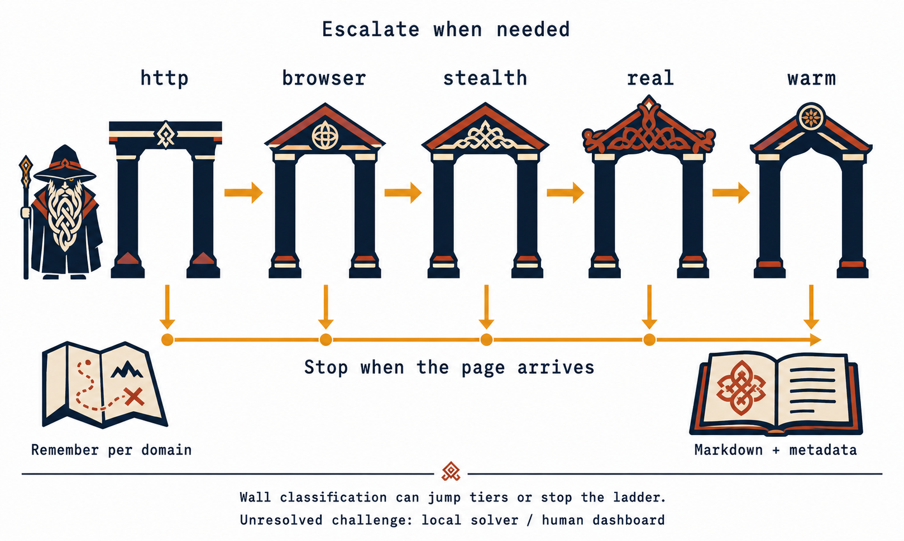

<p align="center">
  <picture>
    <source media="(prefers-color-scheme: dark)" srcset="assets/brand/svipall-lockup-dark.svg">
    
  </picture>
</p>

<h3 align="center">A different face at every gate.</h3>

<p align="center">
  <b>Web reading for your AI agent — running on your own machine.</b><br>
  An MCP server and CLI, in Rust, that extracts web pages into Markdown,<br>
  crawls sites within configured limits, searches without an API key, and attempts supported challenges —<br>
  then tells you plainly about the ones it cannot.
</p>

<p align="center">
  <a href="https://www.rust-lang.org"></a>
  <a href="#license"></a>
  <a href="#mcp-tools"></a>
  <a href="docs/development.md"></a>
  <a href="docs/proof.md"></a>
  <a href="docs/privacy.md"></a>
</p>

<p align="center">
  <a href="#install"><b>Install</b></a> &middot;
  <a href="#what-you-can-actually-do-with-it"><b>Use cases</b></a> &middot;
  <a href="docs/proof.md"><b>Proof</b></a> &middot;
  <a href="#mcp-tools"><b>Tools</b></a> &middot;
  <a href="docs/captcha.md"><b>Captcha</b></a> &middot;
  <a href="#the-rest-api"><b>REST API</b></a> &middot;
  <a href="#how-svipall-compares"><b>Compare</b></a> &middot;
  <a href="docs/faq.md"><b>FAQ</b></a>
</p>

---

**Local processing. No third-party API keys. No paid captcha services. No telemetry.**
Web requests reach the sites you visit, and results reach the agent or client you connect.

Svipall fetches and renders pages locally, extracts their content, and reports detected challenges
and extraction-quality labels. Some sites still block it, and an apparently successful response
can contain incomplete records or a page shell. The published comparisons therefore audit useful
content separately from HTTP status and the tool's own verdict.

## Why Svipall

| What goes wrong | Svipall |
|---|---|
| Your agent reads a "checking your browser" screen and summarises it as the article. It was a `200`, so nothing flagged it | Twelve wall kinds, each naming the move it implies. **Detected blocks carry an explicit verdict**; classification is heuristic [→](docs/features.md#judging-what-came-back) |
| You crawl 5,000 pages and can't tell which are worth keeping | Assessed pages carry quality and duplicate observations; **quality labels do not discard pages** [→](docs/features.md#judging-what-came-back) |
| One page = 300,000 tokens of raw HTML. The fixes are four manual jobs you now own | Clean Markdown by default; opt into tables as rows, `out_file` to disk, or capture of the site's own JSON API [→](docs/features.md#reading) |
| You want to attempt a supported captcha without a paid solver | Fifteen widget families and eleven answer modalities, all local, optional vision models depending on the build, and a human dashboard for unresolved challenges [→](docs/captcha.md) |

It records successful visits, failures, incomplete extraction and rejected changes. Historical
benchmark logs and the current comparison use different scoring rules and configurations;
the [results section](docs/proof.md) distinguishes them.

Rust · MCP + CLI + REST · no Node, no Python, no API key · local storage and processing
→ **[Install it ↓](#install)**

The [comparison table](#how-svipall-compares) describes other projects' documented scope.


---

## Install

**Source and release scope (checked 2026-09-07):** this README describes the current development
tree. The latest published [GitHub release](https://github.com/ilien-dev/svipall/releases) and
[npm package](https://www.npmjs.com/package/svipall) are `1.0.0-rc`, predating the current automatic
routing work and its measurements. Installing that release does not install the changes measured
in the 2026-09-07 comparison. Use the matching source snapshot for those results and run `svipall doctor` to
inspect an installed build's capabilities.

The [README factual audit](bench/experiments/native-auto-candidate2-20260907/readme-factual-audit.md)
records the source checks, documentation corrections and limits of this review.

Choose agent-assisted setup, the Claude Code plugin, or a manual installation.

### Ask the agent you already have

Paste this into Claude Code, Cursor, Codex, opencode, or anything else that can run a command:

```
Install and configure Svipall by following the instructions here:
https://raw.githubusercontent.com/ilien-dev/svipall/main/docs/install.md
```

That page guides an agent through platform detection, installation, verification and MCP
registration. Completion depends on the agent, client configuration and available permissions.

### Claude Code: install the plugin

```
/plugin marketplace add ilien-dev/svipall
/plugin install svipall@svipall
/svipall:setup
```

`/svipall:setup` installs the binary if it is missing, checks the server answers, and offers to make
Svipall the way Claude reaches the web in every project. It asks before each of those.
`/svipall:doctor` reports the installation's capabilities. `/svipall:uninstall` offers removal
of setup's registration, memory and strict-mode changes; binary and data removal are separate choices.

### Install it yourself

One line, no toolchain, nothing to compile:

```bash
curl -fsSL https://raw.githubusercontent.com/ilien-dev/svipall/main/install.sh | sh   # macOS, Linux
irm https://raw.githubusercontent.com/ilien-dev/svipall/main/install.ps1 | iex        # Windows
```

Or a package manager, or the container image:

```bash
brew install ilien-dev/svipall/svipall               # macOS, Linux
scoop bucket add svipall https://github.com/ilien-dev/scoop-svipall && scoop install svipall
docker pull ghcr.io/ilien-dev/svipall:1.0.0-rc       # use a published version tag; see container notes
npx --yes svipall doctor                             # if node is already there
```

The installers verify checksums where they can, and a mismatch stops the install. A missing
checksum file, entry or hashing utility only warns, so a successful exit is not by itself proof
the archive was verified: read the output.

Platform builds, what ships where, building from source and wiring it into any MCP client are all
in [**docs/install.md**](docs/install.md). Never installed anything from a terminal before?
[**GET-STARTED.md**](GET-STARTED.md) is this section with nothing assumed.

### Then ask for something

No key to paste, no account to create, no service to sign up for.

> *"Read this page and summarise the pricing."*
> *"Crawl these docs and write me an `llms.txt`."*
> *"Watch this listing and tell me when the price moves."*
> *"Get me every row of that table as CSV."*

The assistant can choose among the exposed tools. A human dashboard for supported challenges needing a pair of
eyes lives at `http://localhost:8787/human`.

### Or drive it from a shell

```bash
svipall fetch https://example.com/article
svipall fetch https://shop.example/item --query "shipping costs"
svipall fetch https://docs.example/api --schema auto        # rows from a listing you've never seen
svipall crawl https://docs.example/ --pages 50 --out pages.csv
svipall search "rust async runtime" --engine all
svipall snapshot https://news.ycombinator.com                # the page as roles and refs, not markup
svipall serve --port 8788                                    # the same server as a local REST API
```

Completed data commands print **one JSON object** to stdout; diagnostics go to stderr, so their
output can be piped to `jq`. `serve` is a long-running server, and help is written to stderr.

### What comes back

A historical run of `svipall fetch https://example.com`, with the `content` string cut short.
Current automatic fetches also report identity and fallback fields described below:

```json
{
  "attempts": ["http: 200 (170ms) OK"],
  "chars": 167,
  "content": "# Example Domain\n\nThis domain is for use in documentation examples…",
  "exit": null,
  "final_url": "https://example.com/",
  "optimization": "ordinary",
  "quality": "thin",
  "quality_reasons": ["thin_text"],
  "status": 200,
  "tier_used": "http",
  "title": "Example Domain",
  "tokens_estimated": 42,
  "url": "https://example.com"
}
```

`tier_used` says how hard it had to try. `quality` says what actually arrived — and when a page does
*not* arrive, the same object carries `blocked_reason`, `wall_kind`, `wall_vendor`, `wall_evidence`
and a `note` telling your agent what to do next. Straight from a committed benchmark record:

```json
{ "wall_kind": "vendor", "wall_vendor": "kpsdk.io", "wall_evidence": "header x-kpsdk-ct" }
```

**A detected block carries a verdict alongside the returned content.** A clear verdict still
needs a content check; the classifier is not proof that the requested records arrived intact.

## What you can actually do with it

| You want to… | It looks like this |
|---|---|
| **Read one page cleanly** | `web_fetch` → Markdown with heuristic boilerplate removal and sanitization; `query=` ranks text by lexical relevance |
| **Turn a listing into rows** | `schema: "auto"` reads the page's own repeated structure, names the columns and hands back typed rows — no model, no API, one parse |
| **Pull a data table** | `tables=true` → typed rows; `out_file: rows.csv` writes them to disk so thousands of rows never touch your context |
| **Skip the scraping entirely** | `web_capture` returns the JSON the page fetched while loading — usually the site's real API, with `?page=2` waiting for you |
| **Turn a docs site into a corpus** | `web_crawl` with `llms.txt` output, near-duplicate labels, resumable frontier and lexical saturation stopping, subject to page/token/traffic limits |
| **Search without a key** | `web_search` scrapes DuckDuckGo, Bing and Brave; `engine="all"` merges them by agreement |
| **Let the agent click things** | `web_snapshot` (roles + refs, a fraction of the tokens) then `web_act` — click, type, scroll, wait, all through human-like input |
| **Attempt a browser challenge** | Automatic routing can escalate to a patient browser tier; unresolved challenges and detected blocks are reported, but the remote cause is not always identifiable |
| **Attempt a captcha locally** | Fifteen widget families and eleven answer modalities, model support where available and a phone-friendly human dashboard. No paid solver; local budgets and remote restrictions still apply |
| **Log in once and stay in** | `web_login` opens a real window; you sign in; the cookies are kept in a profile you can export |
| **Watch a page** | `web_watch` checks the whole page or one CSS region while the server runs; saved selector fingerprints can help recover some redesigns |
| **Read PDFs and Office files** | docx, xlsx, pptx, odt, epub, rtf, csv and pdf come back as Markdown, from the web or from `file://` |
| **Drive it from any language** | `svipall serve` → 19 local REST routes, one per tool, behind a bearer key it generates for you |

### Who it is for

| You are… | Svipall gives you… |
|---|---|
| **A Claude Code / Claude Desktop / Cursor user** | One line of setup and tools your assistant picks by itself. Research, documentation, price comparison, monitoring |
| **A developer building AI agents** | A local web layer with structured output, token budgets, file export and resumable crawls; live web outcomes remain variable |
| **A RAG / dataset builder** | Bounded site crawls to Markdown, near-duplicate labels, `llms.txt`, and quality observations for assessed pages |
| **A data or research person** | Pages that sit behind "checking your browser" walls — and an honest answer when your address cannot open one |
| **A privacy-conscious operator** | No scraping API, no captcha farm, no geolocation lookup, no update check, no telemetry. Additional downloads are the managed browser when needed (automatic provisioning can be disabled) and the blocklists you enabled |
| **A security or QA engineer** testing your own site | A reproducible benchmark whose raw run logs are committed in this repository, and a request log that names which tier answered and which wall appeared |

Svipall is **not** a hosted scraping API and does not try to be one. If you want a URL you can `curl`
from a serverless function, use a cloud service. If you want the web inside your own agent, on your
own hardware, Svipall provides that processing locally; browser traffic and optional downloads
are described under [Privacy and safety](docs/privacy.md).

---

## How it works, in plain words

<p align="center">
  
</p>

*The diagram shows the emulated tiers. The current automatic policy can promote a supported
emulated route and append one eligible native fallback. Wall verdicts can end the attempt;
content-quality labels alone do not trigger escalation.*

1. **Ask for the page through HTTP first on a new route.** The default engine emulates selected
   Chrome network characteristics. In the historical `public31` runs above, 59 of 93 cells stopped at this tier;
   44 of those scored `ok` under that benchmark's rule. Stopping is not necessarily delivery.
2. **If the page needs JavaScript, open a browser.** Headless Chromium runs the scripts and hands
   back the rendered document.
3. **If the site checks for robots, wear a disguise.** The stealth tier patches known browser
   surfaces to match the emulated identity. The offline probes check those surfaces; they cannot
   prove that an arbitrary detector will accept them.
4. **If the site wants a real person, act like one.** The `real` tier is a visible-but-offscreen
   browser with a persistent profile, moving the pointer along curves and scrolling with a wheel.
5. **If there is a challenge, answer it or wait it out.** The `warm` tier runs the captcha strategy
   loop during its bounded wait and avoids pointer activity on recognized self-verifying
   interstitials. This does not guarantee clearance.
6. **Use native only as a last resort.** When eligible and within the remaining budgets, try one
   native browser attempt. It exposes real device characteristics and reports a privacy notice.
7. **Remember what worked.** Two supporting observations can promote a useful emulated route for
   later visits in the same context. Native stays last even when it succeeds.
8. **Report the observed failure.** Where available, a blocked result includes `blocked_reason`,
   the classified wall, recognized vendor/evidence and a suggested next step. Classification is
   heuristic; transport errors and local budget deferrals may have less page evidence.

---

## MCP tools

Twenty-nine tools, all local.

| Tool | What it does |
|---|---|
| `web_fetch` | Fetch a page as Markdown or structured JSON. `mode=auto` climbs the ladder. `schema` (self-healing), `tables`, `scroll`, `query`, `max_tokens`/`cursor`, `cache`, `include_metadata`, `include_links`, `include_quality`, `use_site_template`, `robots`, `out_file`, `mobile`, `text_only`, `isolated`, `css_selector`, `profile`, `proxy`, `method`/`body`/`headers`. URLs may be `raw:<html>` or `file://` under `local_roots` |
| `web_fetch_many` | Bounded-parallel fetch of many URLs, with `schema` and `tables` as on `web_fetch`. Reports `corroboration` — how many *distinct* documents the set actually is — marks each duplicate with `same_text_as`, and moves the different ones up. It says `reordered_for_diversity` when it did, because a set that comes back in a different order without saying so is a surprise, not a feature |
| `web_search` | DuckDuckGo / Bing / Brave without an API key; `engine="all"` merges by agreement |
| `web_site_search` | Discover a site's search form and learn its query-URL pattern when possible; later fetches still follow normal routing and policy |
| `web_crawl` | Same-domain crawl with robots.txt, dedup, boilerplate removal, `strategy=dfs`, `scroll`, `schema`/`tables` for rows, `llms.txt`, file export, a saturation stop, and a `crawl_id` to resume |
| `web_map` | A site's URLs without crawling it: robots.txt, sitemaps (nested indexes and `.gz` included), RSS/Atom feeds and homepage links — a few hundred tokens of structure instead of the thousands a crawl costs |
| `web_snapshot` | The page as roles, accessible names and short refs that `web_act` accepts. Deterministic, no vision model |
| `web_act` | click, type, fill, press, hover, select, scroll, wait, eval, goto, screenshot, hold, verify, console; supported pointer/keyboard/wheel actions use the behavior layer, while `eval` runs caller-supplied JavaScript |
| `web_capture` | Observe matching JSON/network responses during a bounded browser visit; API usability and completeness are not guaranteed |
| `browser_open` / `browser_do` / `browser_close` | Persistent session with cookies and page state across calls |
| `web_screenshot` | PNG of the rendered page, `full_page` or `mobile` |
| `web_diff` | What changed on a page since Svipall last saw it |
| `web_watch` | Persist a watch and check it while the server runs; list or check to retrieve changes. Region recovery after a redesign is heuristic |
| `web_notes` | Key-value memory that outlives the session |
| `web_log` | Which tier answered, which wall appeared, how long it took, per domain |
| `web_login` | Visible window for a manual login or challenge; cookies saved to a profile |
| `web_route` | Per-domain proxy, or a pool of `proxies` with `countries`; subdomains inherit; `exit_strategy` sticky or round-robin; `check=true` tests the exits (liveness, latency, DNS leak) with no third-party service |
| `web_profile` | Export/import an encrypted browser profile between machines |
| `web_status` | Learned tiers, cooldowns, routes, per-exit health and latency, profiles, open browsers, solver stats, which models answer and from where, whether the host has a real GPU, `h3_offered_by` |
| `browser_setup` | Download or manage Chrome for Testing |
| `solve_and_continue` | Attempt a captcha on the blocked page and return the resulting content or unresolved state |
| `solve_image_captcha` / `solve_recaptcha_v2` / `solve_turnstile` / `solve_hcaptcha` / `captcha_status` / `report_captcha` | Local captcha attempts; the dashboard also exposes `in.php` / `res.php` / `createTask` / `getTaskResult` compatibility endpoints for supported tasks. This is not full compatibility with every solver-client option |

### The CLI

```
svipall fetch | crawl | snapshot | capture | search | map | log | notes | watch
        profile | browser | route | status | serve | doctor | hook
        config show | set | preset
        solver export-corpus
        quality ask | export-training | train
```

A test asserts the usage text names every command the binary answers to, and a second test keeps
[`skill/SKILL.md`](skill/SKILL.md) in step with both.

---

## The REST API

The same server, over HTTP, so any language can drive it — not only an MCP client or a shell.

```bash
svipall serve --port 8788        # the bearer key is printed once, and kept in ~/.svipall/api_key
curl -sH "Authorization: Bearer $KEY" -H 'content-type: application/json' \
     -d '{"url":"https://example.com","query":"pricing"}' localhost:8788/v1/fetch
```

`svipall-mcp` mounts the same router when `rest_port` is set, on its own listener, sharing its
browser pools, page cache and route evidence with the MCP tools.

Nineteen routes, one per tool, each taking that tool's own JSON as the body:

| | |
|---|---|
| `POST /v1/fetch` `/v1/fetch_many` `/v1/crawl` | pages |
| `POST /v1/search` `/v1/site_search` `/v1/map` | finding things |
| `POST /v1/snapshot` `/v1/act` `/v1/capture` `/v1/screenshot` | a real browser |
| `POST /v1/solve_and_continue` | the captcha, answered on the blocked page |
| `POST /v1/diff` `/v1/watch` `/v1/notes` `/v1/log` | memory |
| `POST /v1/route` `/v1/profile` `/v1/browser_setup` | configuration |
| `GET`/`POST /v1/status` | what this installation has learned. `GET` is read-only by construction: the three clearing fields are reachable only by `POST` |
| `GET /v1/health` | the one route with no key, so a container healthcheck does not need one |

A blocked page is a `200`: the call ran, the *page* did not. `blocked_reason`, `wall_kind` and
`note` can appear in the body as over MCP. Non-2xx responses include a malformed body (`400`), a bad key
(`401`), a browser `Origin` or a rebound `Host` (`403`), a body over 2 MB (`413`) or a broken
installation (`500`); an unknown job can return `404`, and routing can reject unsupported paths
or methods. A client must inspect both the HTTP status and the tool result before deciding to retry.

Every tool and job route needs the key, including on loopback; `/v1/health` is exempt.
A local port is not a boundary: Svipall carries
logged-in profiles, cookies and your exit address, so an open one is a proxy wearing your identity.
Two more checks sit in front of the key, because binding to `127.0.0.1` does not stop a page in your
own browser being served a DNS answer of `127.0.0.1` and posting to it: any request carrying an
`Origin` header is refused, and on a loopback bind so is any `Host` that is not loopback. There is no
CORS layer and there will not be one — no browser page is a client of this API.

Ten tools are deliberately **not** routes, in three groups, and `rest.rs` records why next to each:
`browser_open`/`browser_do`/`browser_close`, whose persistent session lifecycle is outside this
REST interface's current design; `web_login`, whose interactive window is also excluded; and the six
`solve_*`/`captcha_status`/`report_captcha` tools, which already answer on the dashboard port in the
classic solver wire shape. Twenty-nine tools minus those ten is the nineteen routes above. A new
`#[tool]` **fails the test suite** until it is listed as a route or as a named exclusion.

A long crawl is a job rather than a held connection. `"async": true` answers `202` with an id; `GET
/v1/jobs/{id}` polls it, `GET /v1/jobs/{id}/stream` follows it as Server-Sent Events, `DELETE` stops
it. The id **is** the `crawl_id`, so there is one handle to learn and resuming is `{"crawl_id": "…"}`
— the same word the MCP tool and the CLI already use. A cancelled crawl stops between pages *after*
that page's links are queued, so its frontier is kept; it is never aborted, because that would leak a
browser page. A job whose process was killed becomes `interrupted`, and `interrupted` is resumable.
The first frame of a stream is always a snapshot from the store, so a subscriber that joins at page
forty is never told the job started at zero. And a queued job whose site already has one running is
held back: two crawls of one site would spend one address's reputation with that host twice as fast,
which is the scarcest thing a local-only tool has. Full contract in [`docs/rest.md`](docs/rest.md).

---

## How Svipall compares

The following describes project scope from primary documentation checked on **2026-09-07**.
It is not a feature-exhaustive comparison or a head-to-head performance test.

| Project | Documented focus |
|---|---|
| Svipall | Local Rust CLI, MCP and REST server; bounded automatic routing, content labels and local challenge attempts with human fallback |
| [Firecrawl](https://github.com/firecrawl/firecrawl) | Web scraping/crawling API with hosted and self-hosted options; the open-source and cloud offerings differ |
| [Crawl4AI](https://github.com/unclecode/crawl4ai) | Python crawler with browser extraction and a Docker server offering API and MCP access |
| [Scrapling](https://github.com/D4Vinci/Scrapling) | Python adaptive parsing, fetchers and spiders, with session/proxy controls and MCP integration |
| [Playwright MCP](https://github.com/microsoft/playwright-mcp) | Browser automation through MCP using structured accessibility snapshots |

The historical benchmark above does not establish current superiority over these
projects. Choose based on your required integration and validate your own target pages.

---

## Everything else

This file is the first minute. The rest is next door, and none of it was deleted.

| | |
|---|---|
| [Install](docs/install.md) | Every platform, what ships where, building from source, wiring it into any MCP client |
| [Proof](docs/proof.md) | Every published number, with the command and the log that reproduce it, failures included |
| [Features](docs/features.md) | The whole surface, tool by tool |
| [Captcha](docs/captcha.md) | Fifteen widget families, eleven answer modalities, and what happens when none of them work |
| [Configuration](docs/configuration.md) | Every key in `~/.svipall`, and what changing it costs |
| [The REST API](docs/rest.md) | Nineteen routes, the job routes, and what a status code means |
| [Extraction](docs/extraction.md) | How a page becomes Markdown, and how well, measured against three corpora |
| [Privacy and safety](docs/privacy.md) | What leaves this machine, and what does not |
| [Limits](docs/limits.md) | Stated on purpose |
| [Architecture](docs/architecture.md) | The crates, and why they are separate |
| [Development](docs/development.md) | Building, testing, and the benchmarks |
| [FAQ](docs/faq.md) | |
| [Exit codes](docs/exits.md) | What the binary returns, for scripts |
| [Models](docs/models.md) | The embedded weights, their licences and their sizes |
| [Firefox](docs/firefox.md) &middot; [HTTP/3](docs/http3.md) &middot; [Benchmarks](docs/bench.md) | The engineering notes |
| [Changelog](CHANGELOG.md) &middot; [Contributing](CONTRIBUTING.md) &middot; [Disclaimer](DISCLAIMER.md) | |

## About the name

**Svipall** is one of Odin's names in *Grímnismál*, stanza 47. Bellows renders it as
“The Changing” in his [translation notes](https://en.wikisource.org/wiki/The_Poetic_Edda_%28tr._Bellows%29/Grimnismol).
The project uses that name as an image of changing appearance, not as a promise of invisibility.

That is the idea behind its emulated identities: keep the machine, browser, network fingerprint
and input behaviour coherent within a session, and retire sessions when they are refused.
Native fallback instead uses real browser/device characteristics. Neither policy guarantees that
a site will accept the visit or be unable to link it to an earlier one.

---

## License

**AGPL-3.0-only**, subject to the terms in [`LICENSE`](LICENSE), including its conditions for
distribution and section 13 on remote network interaction. The component licences and linking
exception below also apply; this paragraph is not a substitute for those terms.

`crates/svipall-extract`, the extraction engine, is deliberately **MIT OR Apache-2.0** so that
anything can depend on it: a library nobody can use is a library nobody reads. `crates/svipall-cdp`
keeps its upstream terms (chromiumoxide, MIT OR Apache-2.0) and `crates/svipall-quic` keeps its own
(quiche, BSD-2-Clause); the default build links BoringSSL under an explicit AGPL section 7 linking
exception. These are set out in [`NOTICE`](NOTICE) and
[`THIRD-PARTY-NOTICES.md`](THIRD-PARTY-NOTICES.md).

## Trademark

The name **Svipall** and the Svipall logo are trademarks of the author. They are **not** licensed
under the AGPL, and nothing in this repository grants a licence to them.

The licence gives you the code. It does not give you the name. Run it, study it, modify it, fork it
and redistribute it freely under the AGPL — but distribute a modified version under a **different
name and without the logo**, so that nobody who downloads it is misled about who produced it or what
is in it.

The project permits descriptive references such as saying that your project uses Svipall,
works with Svipall, or is a fork of Svipall, without implying endorsement.

## Disclaimer

Svipall is provided **as is, with no warranty and no liability**, and it grants you **no
authorisation with respect to any system you point it at**. Complying with the law, with
data-protection rules and with a site's terms is the operator's responsibility, not the author's.
Capability is not permission — read [`DISCLAIMER.md`](DISCLAIMER.md) before you run it against
something that is not yours.

---

<p align="center">
  <sub>
    <b>Keywords:</b> web scraping · web crawler · MCP server · Model Context Protocol · Claude Code ·
    Claude Desktop · Cursor · AI agent tools · LLM web browsing · LLM-ready markdown ·
    html to markdown · RAG data pipeline · anti-bot bypass · Cloudflare bypass · Turnstile · Akamai ·
    PerimeterX · DataDome · Kasada · captcha solver · local captcha solving · headless browser ·
    stealth browser · browser fingerprint · TLS fingerprint JA4 · Chrome impersonation · HTTP/3 QUIC ·
    proxy rotation · Rust · Playwright alternative · Firecrawl alternative · Crawl4AI alternative ·
    Scrapling alternative · local-first · self-hosted · privacy · no API key
  </sub>
</p>
